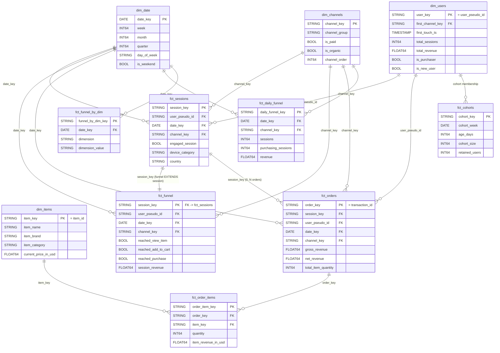
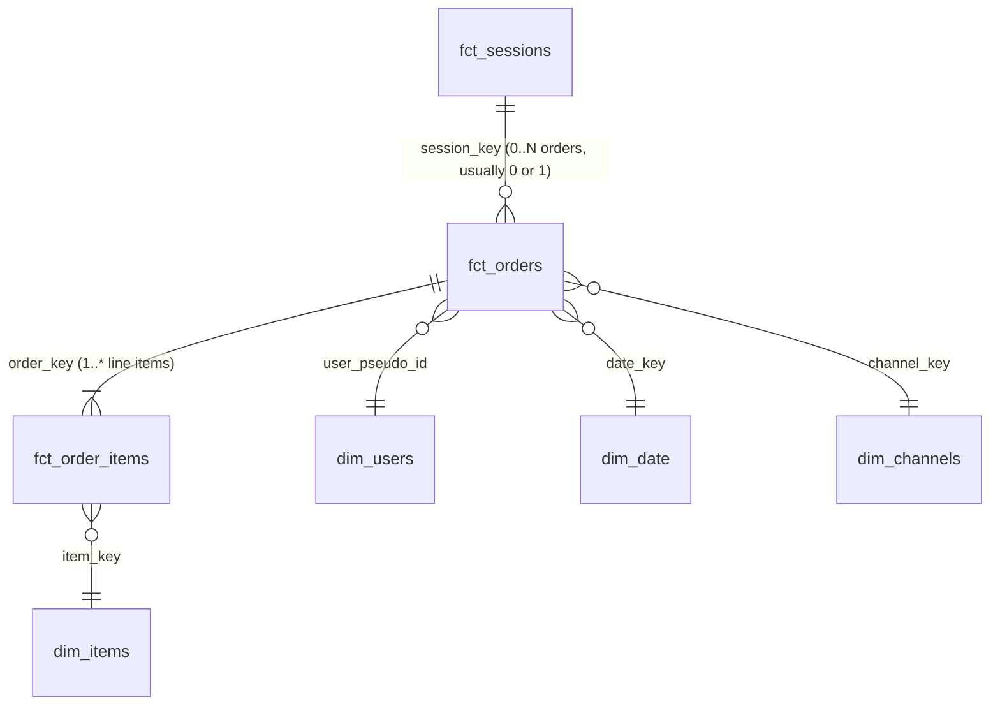

# Helios — Data Model

**`DATA_MODEL.md`** · Companion to `HELIOS_PROJECT_BIBLE.md` §8–§11, `DBT_GUIDE.md`, and `models/semantic/semantic_layer.yaml` · **Version:** v1.0 · **Date:** 2026-06-03

**Purpose.** This is the canonical, production-grade data model for Helios — the single reference for *what tables exist, at what grain, with which keys, who owns them, and why each one exists*. Helios transforms raw GA4 e-commerce events into a Kimball-style star schema (conformed dimensions + fact tables) through a layered dbt pipeline (`raw → staging → intermediate → marts → semantic`). The marts defined here are the substrate the semantic layer exposes as metrics and the agents diagnose against — so the grain discipline, primary keys, and foreign keys below are load-bearing for the entire product.

## How to use this document

- Read §1–§3 first for the whole picture (layered model → ER diagram → master catalog), then the per-model deep dives (§4 Event, §5 Session, §6 User, §7 Product, §8 Order).
- Every table is documented with **grain · primary key · foreign keys · owner/steward · why it exists**.
- This model is consistent with `DBT_GUIDE.md` (the build-time spec) and feeds the 5 grains the semantic layer queries: `fct_funnel`, `fct_sessions`, `fct_orders`, `fct_order_items`, `fct_cohorts`.

## Conventions & keys (cheat-sheet)

| Item | Rule |
|---|---|
| Session key | `session_key = TO_HEX(MD5(CONCAT(user_pseudo_id, '-', CAST(ga_session_id AS STRING))))`; a session = `(user_pseudo_id, ga_session_id)` |
| User key | `user_pseudo_id` — **cookie-grain** (`user_id` is ~always NULL → no cross-device stitching) |
| Order key | `transaction_id` (deduped) |
| Funnel flags | `reached_*` are **max-downstream monotonic** → `sessions ≥ reached_view_item ≥ … ≥ reached_purchase` |
| Channels | 10 GA4 default groups via one `channel_group_case()` macro; `traffic_source` is user first-touch (gotcha) |
| Money | `*_in_usd` only; rates as `SUM(num)/SUM(den)` after grouping |
| Grains of record | **session** (`fct_funnel`/`fct_sessions`), **transaction** (`fct_orders`); marts are **wide** (denormalized dims) |

## Table of Contents

1. Overview & Layered Model
2. Entity Relationship Diagram
3. Master Table Catalog
4. Event Model
5. Session Model
6. User Model
7. Product Model
8. Order Model

## 1. Overview & Layered Model

Helios transforms raw GA4 e-commerce telemetry into a governed, Kimball-style star schema that an autonomous multi-agent system can query *without ever authoring SQL by hand*. The data model is the foundation under everything else: the semantic layer (`semantic_layer.yaml`, 47 metrics) resolves every metric against a small set of mart grains, and the agents compose those governed metrics rather than touching the warehouse directly. This document is the canonical, production-grade specification of every table in that pipeline — its grain, primary key, foreign keys, owner/steward, and, most importantly, *why it exists*.

### 1.1 The layered DAG

Transformations flow through five layers, each with a single, non-overlapping responsibility. Building one logical step per layer is what keeps the warehouse cheap to query, the lineage legible, and downstream models insulated from upstream change.

```text
   bigquery-public-data.ga4_obfuscated_sample_ecommerce.events_YYYYMMDD
                       (date-sharded; one row per EVENT; nested params/items/ecommerce)
                                          |
   ┌──────────────────────────────────────────────────────────────────────────────┐
   │ RAW SOURCE   src_ga4.events                                                     │
   │   read only via source(); never queried directly downstream                    │
   └──────────────────────────────────────────────────────────────────────────────┘
                                          |
   ┌──────────────────────────────────────────────────────────────────────────────┐
   │ STAGING (view)   stg_ga4__events  ·  stg_ga4__event_params                      │
   │   1:1 typed/renamed access; flatten the event_params ARRAY once                 │
   └──────────────────────────────────────────────────────────────────────────────┘
                                          |
   ┌──────────────────────────────────────────────────────────────────────────────┐
   │ INTERMEDIATE (ephemeral/view)   int_ga4__sessionized  ·  int_ga4__funnel_steps  │
   │   business logic: reconstruct the session GA4 never ships; monotonic reached_*  │
   └──────────────────────────────────────────────────────────────────────────────┘
                                          |
   ┌──────────────────────────────────────────────────────────────────────────────┐
   │ MARTS (table/incremental)   star schema: conformed dims + wide fact tables      │
   │   FACTS: fct_sessions, fct_funnel, fct_daily_funnel, fct_orders,                │
   │          fct_order_items, fct_funnel_by_dim, fct_cohorts                        │
   │   DIMS:  dim_users, dim_items, dim_channels, dim_date                           │
   └──────────────────────────────────────────────────────────────────────────────┘
                                          |
   ┌──────────────────────────────────────────────────────────────────────────────┐
   │ SEMANTIC (view-of-marts)   semantic_layer.yaml → semantic-mcp                   │
   │   47 governed metrics resolve against 5 base grains; agents compose, not write  │
   └──────────────────────────────────────────────────────────────────────────────┘
```

**Why each layer exists.**

- **Raw source (`src_ga4.events`)** is the immutable source of truth owned by Google's GA4 export. Its rows are *events* with deeply nested `event_params`, `items[]`, and `ecommerce` structures. We read it exclusively through `source()` so that exactly one model touches the export schema; nothing downstream depends on the raw layout.
- **Staging** is the 1:1 typed/renamed access layer. It surfaces the scalar columns analysts actually need (`session_key`, `ga_session_id`, `page_location`, session-scoped source/medium, `device.*`, `geo.*`, `transaction_id`, `purchase_revenue_in_usd`) and flattens the nested `event_params` array exactly once so no downstream model ever re-`UNNEST`s. Staging isolates the entire pipeline from raw schema drift; materialized as cheap, always-fresh views.
- **Intermediate** holds the business logic that the raw export omits. GA4 ships no session row, so `int_ga4__sessionized` reconstructs one by grouping events on `(user_pseudo_id, ga_session_id)` and `int_ga4__funnel_steps` computes the six monotonic `reached_*` funnel flags. These two are the *keystones*: get them wrong and every downstream number is silently wrong. They are ephemeral/view — never exposed to BI.
- **Marts** are the conformed star schema: wide, denormalized fact tables surrounded by conformed dimensions, materialized as tables (incremental on the large facts) so the autonomous run hits a fixed, predictable BigQuery byte budget.
- **Semantic** is a thin governed view over the marts. It is the *only* path to SQL — `semantic-mcp.build_query` maps a metric name plus dimensions to mart columns, so an agent that asks for `revenue` by `channel_group` never sees a `JOIN` or a `SUM`.

### 1.2 The two grains-of-record

Helios has exactly **two entities of record**, each anchored to its own fact grain:

1. **The session** — one analytical visit, keyed by `session_key = TO_HEX(MD5(CONCAT(user_pseudo_id, '-', CAST(ga_session_id AS STRING))))`. The session is split across two co-grained facts: `fct_sessions` carries engagement and the wide session descriptive dimensions, while `fct_funnel` carries the monotonic `reached_*` flags plus deduped `session_revenue`. `fct_funnel` is the **primary** session grain the semantic layer queries — funnel, conversion, and revenue-per-session metrics all resolve there. The two join 1:1 on `session_key`; the funnel *extends* the session.
2. **The transaction** — one completed order, keyed by `order_key = transaction_id`. `fct_orders` is the deduped order header (gross/net revenue, refund, shipping, tax, quantity) and the entity of record for all order-grain financials. Its line items explode into `fct_order_items`.

A third, derived analytical entity — the **user** (`user_pseudo_id`) — is conformed in `dim_users` but is deliberately *cookie-grain*: `user_id` is almost always NULL in this dataset, so there is no cross-device stitching. One human on a phone and a laptop is two users. This is carried as an honesty caveat on every user-grain metric (ARPU, new/returning users) — they are per-cookie approximations, never true person counts.

### 1.3 Conformed dimensions

Four dimensions conform across the facts so the Decompose agent can pivot any metric across any slice without re-deriving the slice:

- **`dim_date`** — the date spine (2020-11-01..2021-01-31) with week/month/quarter/day-of-week/is_weekend for time-grain rollups.
- **`dim_users`** — the user entity-of-record (cookie-grain) with first-touch attribution and lifetime rollups.
- **`dim_channels`** — the 10 GA4 default channel groups produced by the single `channel_group_case()` macro, plus `is_paid`/`is_organic`/`channel_order`.
- **`dim_items`** — the product catalog (item name, brand, category 1..5, current price).

Because these dimensions are *conformed* (one shared definition, joined by surrogate key), a finding sliced by `device_category` in the funnel and a finding sliced by `device_category` in revenue use the same dimension values — the precondition for honest mix-vs-rate decomposition.

### 1.4 Mart → semantic grain mapping

The semantic layer resolves every one of its 47 metrics against exactly **five base grains**. The mapping is explicit and 1:1:

| Semantic grain | Backing mart | Entity | Metrics resolved here (examples) |
|---|---|---|---|
| `fct_funnel` | `fct_funnel` | session | `sessions`, `users`, `new_users`, `returning_users`, `session_conversion_rate`, `view_to_cart_rate`, `revenue`, `revenue_per_session`, `revenue_per_user` |
| `fct_sessions` | `fct_sessions` | session | `engaged_sessions`, `engagement_rate` |
| `fct_orders` | `fct_orders` | order | `orders`, `gross_revenue`, `net_revenue`, `aov`, `items_per_transaction` |
| `fct_order_items` | `fct_order_items` | order_item | product-level revenue, attach rate, units |
| `fct_cohorts` | `fct_cohorts` | cohort | `day_1_retention`, `day_7_retention`, `day_30_retention` |

The remaining marts — `dim_*`, `fct_daily_funnel`, `fct_funnel_by_dim` — are conformed dimensions or pre-aggregated rollups the agents read *indirectly*. `fct_daily_funnel` and `fct_funnel_by_dim` are additive aggregations of `fct_funnel` that feed the Monitor (anomaly detection), Decompose (mix-shift), and the eval injector; they store additive counts only, and all *rates* are computed in the semantic layer from those counts so they re-aggregate correctly across any slice.

### 1.5 The Kimball / wide-fact philosophy

Helios follows dimensional modelling deliberately. Each fact table declares exactly one grain; conformed dimensions are shared by surrogate key; and the facts are **wide** — descriptive dimensions (`device_category`, `country`, `channel_group`, `is_new_user`, `landing_page`) are denormalized directly onto `fct_funnel`/`fct_sessions`/`fct_orders`. The semantic layer therefore slices a metric by simply `GROUP BY`-ing a column on the same fact, with no join at query time. That is what lets a Sonnet-class agent request "`revenue` by `channel_group` and `device_category` for last week" and get governed, reconciled SQL the agent never wrote: the breadth lives in the mart, not in ad-hoc query construction. Wide facts trade a little storage and ETL discipline for *zero* analyst-authored joins, which is precisely the property the grounding principle ("the LLM never authors raw SQL") requires.

---

## 2. Entity Relationship Diagram

### 2.1 Mermaid ER diagram



> Aggregation (NOT a foreign key): `fct_funnel` is rolled up — `COUNT`/`SUM` of additive measures — into `fct_daily_funnel` (by day × channel × device × country × is_new_user) and into `fct_funnel_by_dim` (by day × canonical dimension). These rollups carry no row-level FK back to `fct_funnel`; they are pre-aggregated derivatives.

### 2.2 ASCII star schema

```text
                                   ┌───────────────┐
                                   │   dim_date    │
                                   │ PK: date_key  │
                                   └───────┬───────┘
                                           │ date_key (1 ── *)
                                           │
   ┌───────────────┐                ┌──────┴───────────────────┐               ┌───────────────┐
   │  dim_users    │  user_pseudo_id│        FACT CORE          │ channel_key   │ dim_channels  │
   │ PK: user_key  ├────────────────┤                          ├───────────────┤ PK:channel_key│
   └───────┬───────┘   (1 ── *)     │  fct_sessions  1───1      │   (1 ── *)    └───────────────┘
           │                        │       │      fct_funnel   │
           │ cohort membership      │       │ session_key       │
           │ (1 ── *)               │       │ (0..N)            │
   ┌───────┴───────┐                │       v                   │
   │  fct_cohorts  │                │   fct_orders              │
   │ PK:cohort_key │                │   PK: order_key           │
   └───────────────┘                │       │ order_key (1 ─ *) │
                                     │       v                   │
                                     │   fct_order_items ────────┼──── dim_items
                                     │   PK: order_item_key      │ item_key (1 ── *)
                                     └──────────┬────────────────┘     PK: item_key
                                                │  aggregation (NOT FK)
                                                v
                                  fct_daily_funnel   fct_funnel_by_dim
                                  (day × dims rollup) (day × dimension rollup)
```

The facts sit in the center; the four conformed dimensions (`dim_date`, `dim_users`, `dim_channels`, `dim_items`) surround them. The two pre-aggregated rollups hang below the core as derived aggregations of `fct_funnel`, not as joined facts.

### 2.3 Relationship walk-through

- **`dim_date` 1 ── * facts (`date_key`).** Every event-grained and daily fact (`fct_sessions`, `fct_funnel`, `fct_orders`, `fct_daily_funnel`, `fct_funnel_by_dim`) carries one `date_key` pointing at exactly one calendar day; a day has many rows in each fact. This is the conformed time axis for all rollups.
- **`dim_users` 1 ── * {`fct_sessions`, `fct_orders`} (`user_pseudo_id`/`user_key`); `dim_users` 1 ── * `fct_cohorts`.** A user has many sessions and zero-or-more orders; cohort membership is a rollup of `dim_users` first-touch into weekly acquisition cohorts. Identity is cookie-grain, so a "user" here is a device+browser cookie, not a person.
- **`dim_channels` 1 ── * {`fct_sessions`, `fct_funnel`, `fct_orders`, `fct_daily_funnel`} (`channel_key`).** One of 10 channel groups attaches to many sessions/orders. Channel is session-scoped first-touch (the `traffic_source` gotcha): the durable user-level `traffic_source` is *first-touch* attribution, so the session-scoped `event_params` source/medium is preferred and the user struct is only a fallback.
- **`dim_items` 1 ── * `fct_order_items` (`item_key`).** One catalog product appears on many order lines; the items dimension never joins above the line-item grain.
- **`fct_sessions` 1 ── 1 `fct_funnel` (`session_key`).** The funnel *extends* the session: exactly one funnel row per session row, same `session_key`. `fct_funnel` is the primary semantic grain; `fct_sessions` adds engagement. Splitting them keeps each fact single-purpose while preserving a clean 1:1 join.
- **`fct_sessions` 1 ── 0..N `fct_orders` (`session_key`).** A session yields zero or more orders — almost always 0 (most sessions don't buy) or 1. This is the bridge that lets revenue-per-session join order revenue back to the session universe.
- **`fct_orders` 1 ── * `fct_order_items` (`order_key`).** One deduped order header explodes into one row per item line. Order-level totals live on the header; line-level revenue lives on the items.
- **Aggregation rollups (NOT FKs).** `fct_funnel` is aggregated into `fct_daily_funnel` (additive daily counts + revenue, the feed for Monitor/Decompose and the eval injector) and `fct_funnel_by_dim` (funnel counts by one canonical dimension, the mix-vs-rate decomposition input). These are `GROUP BY` derivatives, carrying their own surrogate PKs and a `date_key` FK, but no row-level foreign key back to `fct_funnel`.

---

## 3. Master Table Catalog

Every table in the Helios pipeline, from raw source through the growth marts. Use these exact names, PKs, FKs, grains, and owners everywhere; the ER diagram above and every per-model section that follows must agree with this catalog.

| Table | Layer | Grain | Primary Key | Foreign Keys | Owner / Steward | Why it exists |
|---|---|---|---|---|---|---|
| `src_ga4.events` | raw | one row per EVENT | none enforced (natural: `user_pseudo_id`, `event_timestamp`, `event_name`, `event_bundle_sequence_id`) | none | Google / GA4 export | Immutable source of truth; nested `event_params`/`items`/`ecommerce`. Read only via `source()`, never queried directly except through staging. |
| `stg_ga4__events` | staging (view) | EVENT | surrogate `event_id` or natural (`user_pseudo_id`, `event_timestamp`, `event_name`) | → `src_ga4.events` | analytics-eng / platform | 1:1 typed/renamed access layer; surfaces `session_key`, `ga_session_id`, `page_location`, session source/medium, `device.*`, `geo.*`, `transaction_id`, `purchase_revenue_in_usd`. Isolates downstream from raw schema drift. |
| `stg_ga4__event_params` | staging (view) | EVENT × PARAM KEY | (event natural key, `param_key`) | → `src_ga4.events` | analytics-eng / platform | Flattens the nested `event_params` ARRAY once so no downstream model re-`UNNEST`s. |
| `int_ga4__sessionized` | intermediate (ephemeral/view) | SESSION | `session_key` | built from staging | analytics-eng | KEYSTONE. Reconstructs the session row GA4 never ships (group events by `(user_pseudo_id, ga_session_id)`); derives `landing_page`, session-scoped source/medium (`traffic_source` first-touch fallback), `channel_group`, device/geo, `engaged_session`, `is_new_user`, `ga_session_number`. |
| `int_ga4__funnel_steps` | intermediate (ephemeral/view) | SESSION | `session_key` | → `int_ga4__sessionized` | analytics-eng | KEYSTONE. Computes the 6 max-downstream monotonic `reached_*` flags + deduped `session_revenue`. |
| `fct_sessions` | mart / core (table) | SESSION (1 row/session) | `session_key` | `user_pseudo_id` → `dim_users.user_key`; `date_key` → `dim_date`; `channel_key` → `dim_channels` | analytics-eng / Product Analytics | The conformed SESSION entity-of-record: engagement, wide session dims, funnel reach. |
| `fct_funnel` | mart / core (table) | SESSION (1 row/session) | `session_key` (also FK → `fct_sessions`) | → `dim_users`, `dim_date`, `dim_channels` | analytics-eng / Product Analytics | The PRIMARY session grain the semantic layer queries (`reached_*` + `session_revenue` + wide dims); funnel/conversion/RPS resolve here. |
| `fct_daily_funnel` | mart / growth (table) | DAY × [channel_group, device_category, country, is_new_user] | `daily_funnel_key` (md5 of grain) | `date_key` → `dim_date`; `channel_key` → `dim_channels` | analytics-eng / Growth Analytics | Additive pre-aggregated daily funnel counts + revenue; feed for Monitor (anomaly), Decompose (mix-shift), and the eval injector. Rates NOT stored (computed in the semantic layer). |
| `fct_orders` | mart / finance (table) | TRANSACTION (1 row/transaction_id) | `order_key` (= `transaction_id`) | `session_key` → `fct_sessions`; `user_pseudo_id` → `dim_users`; `date_key` → `dim_date`; `channel_key` → `dim_channels` | analytics-eng / Finance & Revenue Analytics | The deduped order header; TRANSACTION entity-of-record; gross/net revenue, refund/shipping/tax, total_item_quantity; revenue & AOV inputs. |
| `fct_order_items` | mart / finance (table) | TRANSACTION × ITEM LINE (1 row/order-item) | `order_item_key` (md5 of transaction_id + item_id + row) | `order_key` → `fct_orders`; `item_key` → `dim_items` | analytics-eng / Finance & Revenue Analytics | The exploded `items[]` array; product-level revenue, items_per_transaction, attach rate. |
| `fct_funnel_by_dim` | mart / growth (table) | DAY × DIMENSION | composite (`date_key`, `dimension`, `dimension_value`) | `date_key` → `dim_date` | analytics-eng / Growth Analytics | Funnel rollup by canonical dimension; the mix-vs-rate decomposition input. |
| `fct_cohorts` | mart / growth (table) | COHORT_WEEK × AGE_DAYS | composite (`cohort_week`, `age_days`[, dims]) | `cohort_week` derived from `dim_users` first-touch | analytics-eng / Growth Analytics | Weekly acquisition cohorts (`cohort_size`, `retained_users`); feeds `day_1/7/30_retention` (semantic grain `fct_cohorts`). Honesty: the ~3-month window right-censors `day_30` for late cohorts. |
| `dim_users` | mart / core (table) | USER (1 row/user_pseudo_id) | `user_key` (= `user_pseudo_id`) | `first_channel_key` → `dim_channels` | analytics-eng (conformed) | The USER entity-of-record (cookie-grain); first-touch attribution, total_sessions/total_revenue, is_purchaser, is_new_user. |
| `dim_items` | mart / core (table) | ITEM (1 row/item_id) | `item_key` (= `item_id`) | none | analytics-eng (conformed) | The conformed PRODUCT catalog dimension (item_name, item_brand, item_category..5, current price). |
| `dim_channels` | mart / core (table) | CHANNEL_GROUP (10 rows) | `channel_key` | none | analytics-eng (conformed) | Conformed channel dimension; the 10 GA4 default groups + is_paid/is_organic/channel_order. |
| `dim_date` | mart / core (table) | DAY (1 row/day) | `date_key` | none | analytics-eng (conformed) | Conformed date spine 2020-11-01..2021-01-31; week/month/quarter/day_of_week/is_weekend for time-grain rollups. |

### Grain discipline

Every table in the catalog declares **exactly one grain**, and that grain is its contract. The four irreducible grains are:

- **SESSION** — one analytical visit, `session_key`. Carried by `int_ga4__sessionized`, `int_ga4__funnel_steps`, `fct_sessions`, and `fct_funnel`. `fct_funnel` is the canonical session grain the semantic layer resolves `sessions`, `users`, conversion rates, and `revenue` against.
- **TRANSACTION** — one completed order, `order_key = transaction_id`. Carried by `fct_orders` and exploded one level down to TRANSACTION × ITEM LINE in `fct_order_items`.
- **ITEM LINE** — one product line within an order, `order_item_key`; the only grain at which product-level revenue and attach rate are valid.
- **COHORT × AGE** — one weekly acquisition cohort at a given `age_days`, `cohort_key`; the grain for retention curves.

Plus the conformed dimension grains (DAY, USER, CHANNEL_GROUP, ITEM) and the two pre-aggregated rollup grains (`fct_daily_funnel` at day × dims; `fct_funnel_by_dim` at day × one dimension).

**Why mixing grains is forbidden.** A metric is only additive and reconcilable at its declared grain. Summing `session_revenue` at order grain, or counting `orders` at session grain, double-counts or under-counts because the row multiplicity differs across facts. The semantic layer enforces this: each metric is bound to one grain (`revenue` → `fct_funnel`, `gross_revenue`/`aov` → `fct_orders`, retention → `fct_cohorts`), and cross-grain comparisons are only sanctioned at the *grand total* (e.g. session-grain `revenue` reconciles to order-grain `gross_revenue` to within 0.5% in aggregate, but can legitimately differ per segment because the joins differ). Declaring one grain per table — and never widening or mixing it — is what makes every governed metric re-aggregate correctly across any slice the Decompose agent requests, and is the precondition for the "0 hallucinated columns / 100% governed SQL" target.

### Ownership model

**`analytics-eng` owns the pipeline end-to-end** — it builds and maintains every model from staging through the marts, owns all four conformed dimensions, and is accountable for the source-to-mart contracts. On top of that engineering ownership, each business domain assigns a **steward** who owns the *semantics* of a fact family: what the numbers mean, which caveats apply, and sign-off on changes that alter business meaning.

| Steward | Stewards which tables | Domain accountability |
|---|---|---|
| Product Analytics | `fct_sessions`, `fct_funnel` | Session/funnel semantics: engagement definition, monotonic `reached_*` flags, conversion-rate definitions. |
| Finance & Revenue Analytics | `fct_orders`, `fct_order_items` | Revenue semantics: dedup-by-transaction, USD-only money, the gross/net/refund/shipping/tax split, AOV basis. |
| Growth Analytics | `fct_daily_funnel`, `fct_funnel_by_dim`, `fct_cohorts` | Aggregation and cohort semantics: additive-counts-only rule, mix-vs-rate decomposition inputs, retention denominators and the right-censoring caveat. |
| analytics-eng (conformed) | `dim_date`, `dim_users`, `dim_channels`, `dim_items` | Conformed dimension definitions: the 10 channel groups, the date spine, cookie-grain user identity, the product catalog. |

**What ownership means in practice.** (1) *Schema changes* — adding, renaming, or retyping a column requires the owning steward's review, because downstream the semantic layer and the eval labels bind to physical names; a rename is a breaking change. (2) *Tests* — the owner is responsible for the dbt tests on their tables: grain-integrity (`unique` on the PK), `not_null` on keys, accepted-range on measures, funnel monotonicity, and revenue reconciliation. Keystone transforms (`int_ga4__sessionized`, `int_ga4__funnel_steps`, revenue dedup) get golden-value tests because they fail silently. (3) *SLAs* — owners commit to freshness (daily; available ≤36h after `event_date` for the semantic-facing facts) and to the CI eval gate: no change to an owned model may drop top-1 diagnosis accuracy by more than the agreed threshold or introduce a hallucinated column. Conformed dimensions, owned solely by analytics-eng, carry the strictest change control because a change there ripples through every fact that joins them.

## 4. Event Model

The GA4 export is an **event stream**, not a table of business entities. Every row in `bigquery-public-data.ga4_obfuscated_sample_ecommerce.events_*` is **one event** — a single thing a user did (loaded a page, viewed a product, added to cart, paid). There is no session row, no order row, and no user row in the raw export; all of those are entities Helios *reconstructs* from the event stream. That is why the **event grain is the atomic foundation of the entire warehouse**: every fact and dimension downstream is a deterministic roll-up of these events, and if the event-access layer is wrong, every number above it is silently wrong. This section documents the event grain, its canonical taxonomy, the nested column shapes, the single flattening pattern Helios sanctions, and the two staging models (`stg_ga4__events`, `stg_ga4__event_params`) that are the only governed doorway between raw GA4 and everything else.

### 4.1 The event grain

| property | value |
|---|---|
| **Grain** | one row per **event** (one user action at one microsecond timestamp) |
| **Natural key** | `(user_pseudo_id, event_timestamp, event_name, event_bundle_sequence_id)` — no enforced PK in raw |
| **Partitioning** | date-sharded tables `events_YYYYMMDD` (read via `_table_suffix`); spans `20201101`–`20210131` |
| **Owner** | Google / GA4 export (we own only the *access* layer, never the raw bytes) |
| **Why it exists** | the immutable **source of truth**; every session, funnel flag, order, and item line is derived from it. We never query it directly except through staging. |

A single visit ("session") is dozens of these event rows that happen to share a `ga_session_id`; a single order is one (or, due to export retries, several) `purchase` rows that share a `transaction_id`. The event grain knows nothing about either — sessionization and order dedup are *our* logic, applied in the intermediate and mart layers. The event row is deliberately "dumb and complete": it carries scalar context (`device.*`, `geo.*`, `traffic_source.*`), nested `event_params`, a nested `items` array, and a scalar `ecommerce` struct, so that any entity we need can be reconstructed without going back to a different source.

### 4.2 Canonical event taxonomy

The table below catalogs the canonical `event_name` values in the dataset: when each fires, the load-bearing `event_params` it carries, and the macro-funnel stage it maps to. The seven **bolded** stages plus `session_start` constitute the session-scoped macro funnel (`session_start → view_item → add_to_cart → begin_checkout → add_shipping_info → add_payment_info → purchase`); the remaining events are engagement/instrumentation signals that inform `engaged_session` and landing-page derivation but are not funnel steps.

| event_name | fires when | key event_params | funnel stage / role |
|---|---|---|---|
| `session_start` | first event of a session | `ga_session_id`, `ga_session_number` | **session_start** (funnel denominator anchor) |
| `first_visit` | first-ever event for a `user_pseudo_id` cookie | `ga_session_id` | drives `is_new_user` / `ga_session_number = 1` |
| `page_view` | any page load | `page_location`, `page_title`, `page_referrer` | engagement; source of `landing_page` |
| `view_promotion` | promo/banner impression | `items[]`, `promotion_id` | top-of-funnel (pre-`view_item`) |
| `view_item_list` | category / search-results / list page view | `items[]`, `item_list_name` | top-of-funnel (pre-`view_item`) |
| `view_item` | product detail page (PDP) view | `items[]`, `page_location` | **view_item** |
| `select_item` | item clicked within a list | `items[]`, `item_list_name` | micro: list → PDP |
| `add_to_cart` | item added to cart | `items[]`, `value`, `currency` | **add_to_cart** |
| `view_cart` | cart drawer / cart page viewed | `items[]`, `value` | micro: cart (between ATC and checkout) |
| `begin_checkout` | checkout initiated | `items[]`, `value`, `coupon` | **begin_checkout** |
| `add_shipping_info` | shipping tier entered | `shipping_tier`, `value` | **add_shipping_info** |
| `add_payment_info` | payment method entered | `payment_type`, `value` | **add_payment_info** |
| `purchase` | order completed | `transaction_id`, `value`, `items[]`, full `ecommerce` struct | **purchase** |
| `scroll` | 90% scroll depth reached | `percent_scrolled` | engagement |
| `click` | outbound / UI click | `link_url`, `outbound` | engagement |
| `user_engagement` | foreground-engagement heartbeat | `engagement_time_msec`, `session_engaged` | drives `engaged_session` / `engagement_time_msec` |

Two honesty notes that ride along with this taxonomy: (1) the funnel built from these events is **session-scoped** and uses **max-downstream** semantics (Section 5), so `view_cart`, `select_item`, and `view_promotion` are deliberately *not* macro-funnel steps — they are micro-signals the Critic can test but are excluded from the canonical six `reached_*` flags. (2) `session_engaged` and `engagement_time_msec` arrive on `user_engagement`, `page_view`, and other events, so engagement is a **session-level aggregate** of these params, not a property of any single event.

### 4.3 The nested event-row structure

A raw GA4 event row mixes four shapes. Understanding them is what makes the "flatten once" rule (Section 4.5) necessary rather than optional.

```text
EVENT ROW (one user action)
├─ scalar columns ........ user_pseudo_id, event_name, event_timestamp (micros),
│                          event_date, event_bundle_sequence_id, user_id (≈ always NULL)
├─ event_params .......... ARRAY<STRUCT<key STRING,
│                              value STRUCT<string_value, int_value, float_value, double_value>>>
│                          → ga_session_id, ga_session_number, page_location, source, medium,
│                            campaign, engagement_time_msec, session_engaged, value, ...
├─ items ................. ARRAY<STRUCT<item_id, item_name, item_brand, item_category,
│                              item_category2..5, item_variant, price_in_usd, price,
│                              quantity, item_revenue_in_usd, coupon>>
│                          → present on view_item / add_to_cart / begin_checkout / purchase
├─ ecommerce ............. STRUCT< transaction_id, purchase_revenue_in_usd, purchase_revenue,
│                              refund_value_in_usd, shipping_value_in_usd, tax_value_in_usd,
│                              total_item_quantity, unique_items >   (populated on purchase)
├─ device ................ STRUCT< category, operating_system, web_info.browser, ... >
├─ geo ................... STRUCT< country, region, city, ... >
└─ traffic_source ........ STRUCT< source, medium, name >   ← USER FIRST-TOUCH (the gotcha, §5.3)
```

Why one row carries all four: GA4 ships a **denormalized, self-contained event**. The cost of that convenience is that the two most important keys in the whole system — `ga_session_id` (the session identity) and the session-scoped `source`/`medium` — are buried inside the `event_params` array and must be `UNNEST`-extracted before any join is possible. The `items` array and `ecommerce` struct are the revenue payload, populated only on `purchase` (and, for `items`, on the cart/checkout events). `device.*`/`geo.*` are scalar structs that need only field access, not unnesting. `traffic_source.*` is a scalar struct too — but a *dangerous* one, because it is user first-touch, not this-session source (Section 5.3).

### 4.4 The `get_event_param` UNNEST pattern

`event_params` is an array, so a key like `ga_session_id` is not a column — it is an element whose `value` lives in exactly one of four typed sub-fields (`string_value`, `int_value`, `float_value`, `double_value`). The governed extraction pattern is a **correlated scalar subquery** over `UNNEST(event_params)`, which returns one scalar per event row and avoids the row fan-out a `CROSS JOIN UNNEST` would cause:

```sql
-- scalar extractors: one value per event, no fan-out
(select ep.value.int_value    from unnest(event_params) ep where ep.key = 'ga_session_id')        as ga_session_id,
(select ep.value.string_value from unnest(event_params) ep where ep.key = 'page_location')        as page_location,
(select ep.value.double_value from unnest(event_params) ep where ep.key = 'engagement_time_msec') as engagement_time_msec
```

This is standardized into the canonical `get_event_param` macro (`macros/get_event_param.sql`) so the typed-slot choice is made in exactly one place and never re-improvised:

```sql

  (select ep.value.{{ type }}_value from unnest(event_params) ep where ep.key = '{{ key }}')

-- usage:  {{ get_event_param('ga_session_id','int') }} as ga_session_id
```

When a model needs to scan *many* param keys at once (rather than pluck a few known ones), `stg_ga4__event_params` provides the fully-exploded alternative — one row per (event, param key) — so callers never re-`UNNEST` the array themselves.

### 4.5 Staging models — `stg_ga4__events` and `stg_ga4__event_params`

Helios flattens the nested event row **exactly once**, in staging, and never again. Everything above staging reads typed scalar columns. This is both a correctness rule (one canonical typed-slot decision; no per-model re-UNNEST drift) and a cost rule (the expensive array work happens in one cheap, always-fresh `view` instead of being repeated in every downstream model).

#### `stg_ga4__events`

| property | value |
|---|---|
| **Layer** | staging (materialized as `view`) |
| **Grain** | one row per **event** (1:1 with raw) |
| **Primary key** | surrogate `event_id`, or the natural key `(user_pseudo_id, event_timestamp, event_name)` |
| **Foreign key** | → `src_ga4.events` (the raw source, via `source()`) |
| **Owner / steward** | analytics-eng / Platform |
| **Why it exists** | the **1:1 typed/renamed access layer**: surfaces every scalar the warehouse needs — `session_key`, `ga_session_id`, `page_location`, session `source`/`medium`, `device.*`, `geo.*`, `ecommerce.transaction_id`, `purchase_revenue_in_usd` — so downstream models are **isolated from raw GA4 schema drift** and never touch the nested arrays. |

```sql
-- stg_ga4__events : 1 row per event, scalars surfaced from the nested raw row
select
  to_hex(md5(user_pseudo_id || '-' || cast(
    {{ get_event_param('ga_session_id','int') }} as string)))      as session_key,
  user_pseudo_id,
  {{ get_event_param('ga_session_id','int') }}                     as ga_session_id,
  {{ get_event_param('ga_session_number','int') }}                 as ga_session_number,
  event_name,
  event_timestamp,
  timestamp_micros(event_timestamp)                                as event_ts,
  parse_date('%Y%m%d', event_date)                                 as event_date,
  {{ get_event_param('page_location') }}                           as page_location,
  {{ get_event_param('engagement_time_msec','int') }}              as engagement_time_msec,
  {{ get_event_param('session_engaged') }}                         as session_engaged,
  -- session-scoped source/medium FIRST; user first-touch only as fallback (the gotcha, §5.3)
  coalesce({{ get_event_param('source') }}, traffic_source.source) as source,
  coalesce({{ get_event_param('medium') }}, traffic_source.medium) as medium,
  {{ get_event_param('campaign') }}                                as campaign,
  device.category                                                  as device_category,
  device.operating_system                                          as operating_system,
  device.web_info.browser                                          as browser,
  geo.country, geo.region,
  ecommerce.transaction_id                                         as transaction_id,
  ecommerce.purchase_revenue_in_usd                                as purchase_revenue_in_usd
from {{ source('src_ga4','events') }}
where _table_suffix between '20201101' and '20210131'
```

`stg_ga4__events` does **only** renames, casts, and the single param-extraction — no business logic, no sessionization, no aggregation. That discipline is what lets it stay a cheap `view` and what makes raw-schema changes a one-file fix.

#### `stg_ga4__event_params`

| property | value |
|---|---|
| **Layer** | staging (materialized as `view`) |
| **Grain** | one row per **event × param key** |
| **Primary key** | `(event natural key, param_key)` |
| **Foreign key** | → `src_ga4.events` |
| **Owner / steward** | analytics-eng / Platform |
| **Why it exists** | flattens the nested `event_params` ARRAY **once** into a long table so **no downstream model ever re-UNNESTs**; the multi-key / exploratory complement to the scalar extractors on `stg_ga4__events`. |

```sql
-- stg_ga4__event_params : 1 row per (event, param key), all typed slots exposed
select
  to_hex(md5(user_pseudo_id || '-' || cast(event_timestamp as string) || '-' || event_name)) as event_key,
  user_pseudo_id, event_name, event_timestamp,
  ep.key                  as param_key,
  ep.value.string_value   as string_value,
  ep.value.int_value      as int_value,
  ep.value.float_value    as float_value,
  ep.value.double_value   as double_value
from {{ source('src_ga4','events') }}, unnest(event_params) ep
```

#### Why flatten once, in staging

1. **Single typed-slot decision.** Choosing `int_value` vs `double_value` for a key is a correctness call; making it once (in the macro / staging) eliminates an entire class of silent type bugs.
2. **No fan-out drift.** The scalar-subquery pattern keeps `stg_ga4__events` 1:1 with raw; if every model re-unnested ad hoc, a stray `CROSS JOIN UNNEST` would multiply rows and quietly inflate counts.
3. **Cost.** The array scan is the expensive part of touching GA4. Doing it in one cheap `view` keeps the autonomous run inside its fixed byte budget rather than paying for the UNNEST in every mart.
4. **Schema-drift isolation.** When GA4 renames a struct or moves a param, exactly one staging model changes; the marts and the semantic layer are untouched.

This is the structural reason the event model is the atomic foundation: **everything above staging composes typed scalars, never raw arrays.**

---

## 5. Session Model

GA4 ships events, not sessions. The **session** is the first entity Helios reconstructs, and it is the spine of the whole product: the macro funnel, every rate metric, engagement, and most dimensional slicing all live at session grain. This section defines sessionization precisely, then documents the five session-grain models — `int_ga4__sessionized`, `fct_sessions`, `fct_funnel`, `fct_daily_funnel`, and `fct_funnel_by_dim` — each with grain, primary key, foreign keys, owner/steward, a "why it exists" line, and full column intent.

### 5.1 What a session is, and the `session_key`

A **session = `(user_pseudo_id, ga_session_id)`**. `user_pseudo_id` is the device/cookie identifier; `ga_session_id` is GA4's per-cookie session counter, carried inside `event_params`. The canonical surrogate — used identically everywhere, never re-improvised — is:

```sql
session_key = TO_HEX(MD5(CONCAT(user_pseudo_id, '-', CAST(ga_session_id AS STRING))))
-- sessions = COUNT(DISTINCT session_key)   -- never FARM_FINGERPRINT, never COUNT(*)
```

GA4 starts a new `ga_session_id` after 30 minutes of inactivity **and** at UTC midnight, so one human visit that straddles midnight splits into two sessions. A session is attributed to the **day of its first event** (`min(event_timestamp)`), so a midnight-crossing session counts once, on its start day. Rows with a NULL `ga_session_id` cannot be sessionized and are dropped at the intermediate layer.

**Honesty note (cookie-grain identity).** The user key is `user_pseudo_id`, a **device + browser cookie**, not a person. `user_id` is almost always NULL in this obfuscated export, so **no cross-device stitching** is possible: one human on phone + laptop is two users, and cookie churn (clearing cookies, Safari ITP / Firefox ETP ~7-day client-cookie caps, incognito) re-mints the same human as a new user. Every user-grain count inherits this bias; the Critic always caveats `users`/`new_users`/`returning_users`/ARPU as cookie approximations, never true person counts.

### 5.2 Derived session attributes

Sessionization reconstructs, per `(user_pseudo_id, ga_session_id)` group, the attributes GA4 never ships as a row:

- **`landing_page`** — the `page_location` of the **earliest-timestamp event** carrying one (typically `session_start` / `first_visit` / the first `page_view`).
- **`session_start_micros` / `session_end_micros`** — `min` / `max` of `event_timestamp`; `date_key = DATE(TIMESTAMP_MICROS(session_start_micros))`.
- **`is_new_user`** — `ga_session_number = 1` (the cookie's first session); equivalently the session that contains `first_visit`.
- **`ga_session_number`** — the session ordinal for the cookie, bucketed downstream into `session_number_bucket`.
- **`device_category` / `operating_system` / `browser` / `country` / `region`** — `any_value` within the session (stable per visit).
- **`engaged_session`** — see §5.4.
- **`channel_group`** — derived from session `source`/`medium` via the single `channel_group_case()` macro (`macros/channel_group.sql`), the only place channel logic lives, producing exactly the 10 GA4 default groups.

### 5.3 Session-scoped source/medium and the `traffic_source` first-touch FALLBACK gotcha

This is the single most error-prone attribution detail in the dataset. The scalar `traffic_source` struct on every event is **USER FIRST-TOUCH** — the source/medium that *originally acquired the cookie*, repeated unchanged on every later event regardless of how the current session actually arrived. Using it as "the session's channel" mis-attributes every returning session to its original acquisition channel.

The governed rule: **prefer the session-scoped `event_params.source`/`medium`** (which reflect how *this* session arrived), and **fall back to the user-level `traffic_source` struct only when the session params are NULL**:

```sql
coalesce({{ get_event_param('source') }}, traffic_source.source, '(direct)') as source,
coalesce({{ get_event_param('medium') }}, traffic_source.medium, '(none)')   as medium
```

This is the only sanctioned source/medium path. `channel_group` then flows from these session-scoped values through `channel_group_case()`. Carried caveat: because attribution is session-scoped occurrence, channel-sliced metrics answer "which channel was *this session* on", not "which channel deserves credit" — there is no last-non-direct or data-driven model, and (critically) no cost data, so ROI/ROAS is impossible from this layer.

### 5.4 Engaged session and new user

- **`engaged_session`** = `session_engaged = '1' OR engagement_time_msec >= 10000` — GA4's own engaged-session bar (10+ seconds, or a conversion / multiple pageviews), aggregated to session grain (`LOGICAL_OR` of the flag; `MAX` of engagement time). It is a non-bounce / attention proxy, **not** funnel progress: an engaged session need not view a product, and `engagement_rate = engaged_sessions / sessions`.
- **`is_new_user`** = `ga_session_number = 1`. Honesty note: "new" is cookie-first-session, not first-time-human; cookie churn systematically inflates `new_users`.

### 5.5 `int_ga4__sessionized` — the sessionization keystone

| property | value |
|---|---|
| **Layer** | intermediate (`ephemeral` / `view`; **not** exposed to BI) |
| **Grain** | one row per **session** |
| **Primary key** | `session_key` |
| **Foreign keys** | built from `stg_ga4__events` (no mart FKs yet) |
| **Owner / steward** | analytics-eng |
| **Why it exists** | reconstructs the **session row GA4 never ships** by grouping events on `(user_pseudo_id, ga_session_id)`; derives `landing_page`, session-scoped `source`/`medium` (with the `traffic_source` first-touch fallback), `channel_group`, device/geo, `engaged_session`, `is_new_user`, `ga_session_number`. **KEYSTONE** — if sessionization is wrong, every downstream number is silently wrong. |

```sql
-- int_ga4__sessionized : 1 row per (user_pseudo_id, ga_session_id)
select
  to_hex(md5(user_pseudo_id || '-' || cast(ga_session_id as string)))                       as session_key,
  user_pseudo_id, ga_session_id,
  any_value(ga_session_number)                                                              as ga_session_number,
  min(event_timestamp)                                                                      as session_start_micros,
  max(event_timestamp)                                                                      as session_end_micros,
  array_agg(page_location ignore nulls order by event_timestamp limit 1)[safe_offset(0)]    as landing_page,
  -- session-scoped source/medium with user first-touch FALLBACK (the gotcha)
  coalesce(array_agg(source ignore nulls order by event_timestamp limit 1)[safe_offset(0)], '(direct)') as source,
  coalesce(array_agg(medium ignore nulls order by event_timestamp limit 1)[safe_offset(0)], '(none)')   as medium,
  any_value(device_category) as device_category, any_value(operating_system) as operating_system,
  any_value(browser) as browser, any_value(country) as country, any_value(region) as region,
  countif(true)                                                                             as event_count,
  max(coalesce(engagement_time_msec, 0))                                                    as engagement_time_msec,
  logical_or(session_engaged = '1')                                                         as session_engaged_flag
from {{ ref('stg_ga4__events') }}
where ga_session_id is not null
group by user_pseudo_id, ga_session_id
```

### 5.6 The `reached_*` MAX-DOWNSTREAM monotonic flags

The funnel is computed in `int_ga4__funnel_steps` (session grain, PK `session_key`, FK → `int_ga4__sessionized`; the second **KEYSTONE**) and carried onto `fct_funnel`. Each of the six `reached_*` flags uses **max-downstream** semantics: a session **reached stage X if it fired X *or any later funnel-stage event*** during the visit. Rolling each flag forward to every downstream stage makes the funnel **monotonic by construction**:

```text
sessions ≥ reached_view_item ≥ reached_add_to_cart ≥ reached_begin_checkout
         ≥ reached_add_shipping_info ≥ reached_add_payment_info ≥ reached_purchase
```

Because every downstream flag implies all upstream flags, a later-stage count can **never exceed** an earlier one, which is exactly what guarantees every step rate is **≤ 1** (e.g. `view_to_cart_rate = add_to_cart_sessions / view_item_sessions ≤ 1`). It also avoids dropping legitimate journeys that, say, re-add a cart item without re-firing `view_item`. (The retired `did_*` names are forbidden; an ordered/strict variant exists for the Critic to test step-skipping hypotheses but is not the default.) The canonical expression:

```sql
-- int_ga4__funnel_steps : 1 row per session, max-downstream (monotonic) flags
select
  to_hex(md5(user_pseudo_id || '-' || cast(ga_session_id as string)))                                                       as session_key,
  user_pseudo_id,
  true                                                                                                                       as did_session_start,
  logical_or(event_name in ('view_item','add_to_cart','begin_checkout','add_shipping_info','add_payment_info','purchase'))   as reached_view_item,
  logical_or(event_name in ('add_to_cart','begin_checkout','add_shipping_info','add_payment_info','purchase'))               as reached_add_to_cart,
  logical_or(event_name in ('begin_checkout','add_shipping_info','add_payment_info','purchase'))                             as reached_begin_checkout,
  logical_or(event_name in ('add_shipping_info','add_payment_info','purchase'))                                              as reached_add_shipping_info,
  logical_or(event_name in ('add_payment_info','purchase'))                                                                  as reached_add_payment_info,
  logical_or(event_name = 'purchase')                                                                                        as reached_purchase
from {{ ref('stg_ga4__events') }}
where ga_session_id is not null
group by user_pseudo_id, ga_session_id
```

### 5.7 `fct_sessions` — the conformed session entity-of-record

| property | value |
|---|---|
| **Grain** | **SESSION** — one row per session |
| **Primary key** | `session_key` |
| **Foreign keys** | `user_pseudo_id` → `dim_users.user_key`; `date_key` → `dim_date.date_key`; `channel_key` → `dim_channels.channel_key` |
| **Owner / steward** | analytics-eng / Product Analytics |
| **Why it exists** | the conformed **SESSION entity-of-record**: the wide session-dimension row (engagement + descriptive dims + funnel reach) that all session-grain analysis conforms to. Carries `engaged_sessions`. |

| column | type | key | intent |
|---|---|---|---|
| `session_key` | STRING | PK | `TO_HEX(MD5(user_pseudo_id || '-' || ga_session_id))` |
| `user_pseudo_id` | STRING | FK → dim_users | device/cookie key (de-facto user) |
| `ga_session_id` | INT64 | | session id within the cookie |
| `date_key` | DATE | FK → dim_date | session start date (from `min(event_timestamp)`) |
| `session_start_ts` / `session_end_ts` | TIMESTAMP | | first / last event timestamp of the session |
| `channel_key` | STRING | FK → dim_channels | session-scoped channel-group surrogate |
| `source` / `medium` / `campaign` | STRING | | session-scoped acquisition (first-touch fallback) |
| `landing_page` | STRING | | first `page_location` of the session |
| `device_category` / `operating_system` / `browser` | STRING | | session device descriptors |
| `country` / `region` | STRING | | session geo descriptors |
| `is_new_user` | BOOL | | `ga_session_number = 1` |
| `ga_session_number` | INT64 | | session ordinal for the cookie |
| `event_count` | INT64 | | events in the session |
| `engaged_session` | BOOL | | `session_engaged = '1' OR engagement_time_msec >= 10000` |
| `engagement_time_msec` | INT64 | | summed engagement time |

### 5.8 `fct_funnel` — the semantic layer's primary session grain

| property | value |
|---|---|
| **Grain** | **SESSION** — one row per session |
| **Primary key** | `session_key` (also FK → `fct_sessions`) |
| **Foreign keys** | → `dim_users` (`user_pseudo_id`), `dim_date` (`date_key`), `dim_channels` (`channel_key`) |
| **Owner / steward** | analytics-eng / Product Analytics |
| **Why it exists** | the **PRIMARY session grain the semantic layer queries**: the monotonic `reached_*` flags + deduped `session_revenue` + wide session dims, so `sessions`, `users`, the funnel rates, conversion, and `revenue_per_session` all resolve here. **`fct_funnel` EXTENDS `fct_sessions` 1:1.** |

| column | type | key | intent |
|---|---|---|---|
| `session_key` | STRING | PK / FK → fct_sessions | session id (1:1 with `fct_sessions`) |
| `user_pseudo_id` | STRING | FK → dim_users | user key |
| `date_key` | DATE | FK → dim_date | session date |
| `channel_key` | STRING | FK → dim_channels | channel group |
| `device_category` / `country` / `is_new_user` | | | wide dims, denormalized so the semantic layer slices without joins |
| `did_session_start` | BOOL | | always TRUE — the denominator anchor (= `sessions`) |
| `reached_view_item` | BOOL | | reached `view_item` **or any later stage** (max-downstream) |
| `reached_add_to_cart` | BOOL | | reached `add_to_cart` or beyond |
| `reached_begin_checkout` | BOOL | | reached `begin_checkout` or beyond |
| `reached_add_shipping_info` | BOOL | | reached `add_shipping_info` or beyond |
| `reached_add_payment_info` | BOOL | | reached `add_payment_info` or beyond |
| `reached_purchase` | BOOL | | fired `purchase` |
| `session_revenue` | FLOAT64 | | `SUM(purchase_revenue_in_usd)` in the session, **deduped to one value per `transaction_id`**; 0 for non-purchasing sessions |

The **1:1 `fct_sessions` ↔ `fct_funnel`** split is deliberate: `fct_sessions` is the descriptive session entity (engagement, dims), while `fct_funnel` carries the funnel + revenue payload at the same grain. The semantic layer points its `session`, `user`, and `revenue` (session-attributed) metrics at `fct_funnel`, computing every rate as `SUM(numerator)/SUM(denominator)` over additive counts (e.g. `session_conversion_rate = COUNTIF(reached_purchase) / COUNT(*)`) so rates re-aggregate correctly across any dimension the Decompose agent slices.

### 5.9 `fct_daily_funnel` — pre-aggregated additive daily funnel

| property | value |
|---|---|
| **Grain** | **DAY × [`channel_group`, `device_category`, `country`, `is_new_user`]** |
| **Primary key** | `daily_funnel_key` (md5 of the grain columns) |
| **Foreign keys** | `date_key` → `dim_date`; `channel_key` → `dim_channels` |
| **Owner / steward** | analytics-eng / Growth Analytics |
| **Why it exists** | additive **pre-aggregated daily funnel counts + revenue**; the feed for **Monitor** (time-series anomaly), **Decompose** (mix-shift), and the eval injector. Aggregates `fct_funnel` (which carries `session_revenue`) — **rates are NOT stored**, they recompute in the semantic layer so they stay re-aggregatable across any slice. |

| column | type | intent |
|---|---|---|
| `daily_funnel_key` | STRING | md5 of grain columns (PK) |
| `date_key` | DATE | day |
| `channel_key` | STRING | channel group |
| `device_category` / `country` / `is_new_user` | | grain dimensions |
| `sessions` | INT64 | `COUNT(DISTINCT session_key)` |
| `users` / `new_users` / `returning_users` | INT64 | distinct users (all / new / returning) |
| `engaged_sessions` | INT64 | sessions where `engaged_session` |
| `view_item_sessions` | INT64 | `SUM(reached_view_item)` |
| `add_to_cart_sessions` | INT64 | `SUM(reached_add_to_cart)` |
| `begin_checkout_sessions` | INT64 | `SUM(reached_begin_checkout)` |
| `add_shipping_info_sessions` | INT64 | `SUM(reached_add_shipping_info)` |
| `add_payment_info_sessions` | INT64 | `SUM(reached_add_payment_info)` |
| `purchasing_sessions` | INT64 | `SUM(reached_purchase)` |
| `transactions` | INT64 | distinct `transaction_id` |
| `revenue` | FLOAT64 | `SUM(session_revenue)` |

Storing only additive counts (never rates) is the Simpson's-paradox defense: any rate the agents need is `SUM(num)/SUM(den)` recomputed at the requested grain, so a daily-grain table rolls up to week/month or to any dimension subset without re-deriving rates from pre-divided ratios.

### 5.10 `fct_funnel_by_dim` — single-dimension funnel rollup

| property | value |
|---|---|
| **Grain** | **DAY × DIMENSION** (one canonical dimension at a time) |
| **Primary key** | composite `(date_key, dimension, dimension_value)` |
| **Foreign keys** | `date_key` → `dim_date` |
| **Owner / steward** | analytics-eng / Growth Analytics |
| **Why it exists** | the funnel rolled up by a single **canonical dimension** (long/unpivoted: a `dimension` name + `dimension_value`); the direct input to the **mix-vs-rate decomposition** (`decompose_change`). |

| column | type | intent |
|---|---|---|
| `date_key` | DATE | day (PK part) |
| `dimension` | STRING | the dimension name (e.g. `channel_group`, `device_category`, `country`) — PK part |
| `dimension_value` | STRING | the value within that dimension — PK part |
| `sessions` | INT64 | mix weight `w_i` for `decompose_change` |
| `view_item_sessions` … `purchasing_sessions` | INT64 | the same additive `reached_*` counts as `fct_daily_funnel` |
| `transactions` | INT64 | distinct `transaction_id` |
| `revenue` | FLOAT64 | `SUM(session_revenue)` |

Both `fct_daily_funnel` and `fct_funnel_by_dim` are **aggregations of `fct_funnel`, not FK children of it** — they materialize the same session-grain counts at coarser, agent-friendly grains. `fct_funnel_by_dim` deliberately holds one dimension at a time so the Decompose agent gets a clean `(w_i, r_i)` table per dimension: `sessions` is the mix weight, the `reached_*` counts give per-segment rates, and `decompose_change` splits any movement into mix / rate / interaction.

### 5.11 The session model as the analytical spine

Every model in this section traces back to one reconstruction — grouping events by `(user_pseudo_id, ga_session_id)` — and serves a distinct purpose: `int_ga4__sessionized` rebuilds the missing session row; `int_ga4__funnel_steps` adds the monotonic reach; `fct_sessions` is the conformed descriptive entity-of-record; `fct_funnel` is the 1:1 funnel + revenue extension that the **semantic layer queries directly**; and `fct_daily_funnel` / `fct_funnel_by_dim` pre-aggregate the same additive counts for Monitor, Decompose, and the eval injector. Honesty carries through the whole chain: identity is **cookie-grain** (no cross-device stitching), channel is **session-scoped occurrence with a first-touch fallback** (not attributed credit, and no cost data for ROI), and the ~3-month export window (Nov 2020 – Jan 2021) bounds every "returning"/cohort claim built on top of these sessions.

## 6. User Model

The user grain answers a different question than the session grain: not "what happened in this visit?" but "who is this person, where did they come from, and do they come back?" Helios resolves that grain with one conformed dimension (`dim_users`) and one acquisition-cohort fact (`fct_cohorts`). Both are built on a foundation that must be stated up front and carried into every user-level number: **identity in this dataset is cookie-grain, not person-grain.**

### 6.1 dim_users — the conformed USER entity-of-record

| property | value |
|---|---|
| Grain | one row per `user_pseudo_id` (USER = device/cookie) |
| Primary key | `user_key` (= `user_pseudo_id`) |
| Foreign keys | `first_channel_key` -> `dim_channels.channel_key` |
| Owner / steward | analytics-eng (conformed dimension) |
| Materialization | `table` |

**Why it exists.** GA4 ships events, not users. To answer "how many users did we acquire?", "what channel first brought them?", "is this a buyer?", and to provide a stable denominator for `revenue_per_user` (ARPU), Helios collapses the entire event stream to one row per `user_pseudo_id`. `dim_users` is the **single conformed user dimension** that `fct_sessions` and `fct_orders` join to (`user_pseudo_id` -> `user_key`) and that `fct_cohorts` rolls up from. Putting first-touch attribution and lifetime roll-ups here — rather than recomputing them per query — is what lets the semantic layer slice user metrics without re-scanning raw events.

| column | type | key | description |
|---|---|---|---|
| user_key | STRING | PK | `user_pseudo_id` (the cookie/device id) |
| first_touch_ts | TIMESTAMP | | `MIN(user_first_touch_timestamp)` — the user's first-ever event time |
| first_touch_source | STRING | | session-scoped source of the user's first session (first-touch) |
| first_touch_medium | STRING | | session-scoped medium of the first session |
| first_channel_key | STRING | FK -> dim_channels | `channel_group` surrogate of the first session (first-touch attribution) |
| total_sessions | INT64 | | `COUNT(DISTINCT session_key)` for the user |
| total_revenue | FLOAT64 | | `SUM(session_revenue)` (deduped) across the user's sessions |
| is_purchaser | BOOL | | TRUE if `total_revenue > 0` / the user has >= 1 transaction |
| is_new_user | BOOL | | TRUE if the user first appears in-window (first session has `ga_session_number = 1`) |

```sql
-- dim_users : one conformed row per user_pseudo_id, first-touch attribution + lifetime roll-ups
with first_session as (
  -- the user's earliest session decides first-touch source/medium/channel
  select user_pseudo_id,
         array_agg(struct(source, medium, channel_group)
                   order by session_start_micros limit 1)[safe_offset(0)] as ft
  from {{ ref('fct_sessions') }}
  group by user_pseudo_id
)
select
  s.user_pseudo_id                                   as user_key,
  timestamp_micros(min(s.first_touch_micros))        as first_touch_ts,
  any_value(fs.ft.source)                            as first_touch_source,
  any_value(fs.ft.medium)                            as first_touch_medium,
  any_value(c.channel_key)                           as first_channel_key,
  count(distinct s.session_key)                      as total_sessions,
  coalesce(sum(s.session_revenue), 0.0)              as total_revenue,
  coalesce(sum(s.session_revenue), 0.0) > 0          as is_purchaser,
  logical_or(s.ga_session_number = 1)                as is_new_user
from {{ ref('fct_sessions') }} s
join first_session fs using (user_pseudo_id)
left join {{ ref('dim_channels') }} c on c.channel_group = fs.ft.channel_group
group by 1
```

### 6.2 Cookie-grain identity — stated honestly

The user key is `user_pseudo_id`, the GA4 device/cookie identifier. The cross-device identifier `user_id` **is almost always NULL** in this obfuscated public dataset, so Helios performs **no identity stitching**. The consequences are not edge cases; they are structural, and the Critic agent attaches them to every user-grain finding:

- **A person on phone + laptop is two users.** Two cookies, two `user_pseudo_id`s, two rows in `dim_users`. There is no key that reunites them. `users`, `new_users`, and ARPU are therefore *device-cookie counts*, not headcounts, and are always over-stated relative to true humans.
- **Cookie churn inflates `new_users`.** Cleared cookies, Safari/ITP cookie expiry, incognito sessions, and re-consent all mint a fresh `user_pseudo_id`. A returning human on a new cookie looks simultaneously like a **churned user** (the old cookie went quiet) and a **brand-new acquisition** (the new cookie appears). New-vs-returning splits, and retention denominators, are biased by exactly this churn.
- **First-touch attribution lives on `dim_users`.** `first_touch_source / first_touch_medium / first_channel_key` capture the acquisition channel of the user's earliest session. This is deliberately a session-scoped attribution materialized once on the user row — *not* the raw `traffic_source` struct. (The `traffic_source` gotcha: event-level `traffic_source.*` is itself GA4's first-touch attribution, so reading it per session mislabels every later session with the acquisition channel. `dim_users` is the *correct* home for first-touch; `fct_sessions` carries session-scoped source instead.)
- **New vs returning is `ga_session_number = 1`.** A session is a new-user session when its `ga_session_number` (the per-cookie session ordinal) equals 1 — equivalently, when the `first_visit` event fired in it. `is_new_user` on `dim_users` is `LOGICAL_OR(ga_session_number = 1)` across the user's sessions; on `fct_sessions`/`fct_funnel` the same flag is per-session. Because the ordinal is per-*cookie*, churned-cookie returners are mis-classed as new — the same bias as above, surfaced through a different column.

> Honesty contract: any metric divided by `users` (ARPU, `new_users`, `returning_users`, all `day_N_retention`) is a **cookie-grain approximation** and must be narrated as such. Helios never claims person-level precision it does not have.

### 6.3 fct_cohorts — weekly acquisition cohorts feeding retention

| property | value |
|---|---|
| Grain | one row per (`cohort_week`, `age_days`) [optionally x dims] |
| Primary key | composite (`cohort_week`, `age_days`[, dims]) |
| Foreign keys | `cohort_week` derived from `dim_users.first_touch_ts` (cohort-membership rollup of `dim_users`) |
| Owner / steward | analytics-eng / Growth Analytics |
| Materialization | `table` |

**Why it exists.** Retention is a *cohort* question — "of the users we acquired in week W, how many came back by lifecycle-day N?" — and that cannot be answered from `dim_users` (no time-since-acquisition axis) or `fct_sessions` (no fixed acquisition denominator). `fct_cohorts` is the purpose-built fact whose grain *is* (acquisition week x lifecycle age), pre-computing `cohort_size` and `retained_users_d1/d7/d30` so the semantic layer's `day_1_retention`, `day_7_retention`, and `day_30_retention` resolve as simple `SUM(retained_users_dN) / SUM(cohort_size)` aggregations. It is the grain named by those three metrics (`grain: fct_cohorts`) and the input to `stats-mcp.cohort_retention`.

| column | type | key | description |
|---|---|---|---|
| cohort_week | DATE | PK | ISO-week (Monday) of `dim_users.first_touch_ts` — the acquisition cohort |
| age_days | INT64 | PK | lifecycle day relative to first touch (0, 1, 7, 30 are the reported anchors) |
| cohort_size | INT64 | | distinct users first-touched in `cohort_week` — the **FIXED** denominator |
| retained_users_d1 | INT64 | | users in the cohort with any session by lifecycle-day 1 |
| retained_users_d7 | INT64 | | users in the cohort with any session by lifecycle-day 7 |
| retained_users_d30 | INT64 | | users in the cohort with any session by lifecycle-day 30 |

How users roll in: every user lands in exactly one cohort, keyed by the ISO week (Monday) of `first_touch_ts` on `dim_users`. `cohort_size` is that week's distinct-user count and is **constant across all age rows of the cohort** (an invariant the semantic layer asserts). A user contributes to `retained_users_dN` if they have any session by lifecycle-day N — cumulative return *by* day N, not "active exactly on day N." Because the denominator is the fixed original cohort (never the surviving population), retention is monotonically non-increasing by construction: `day_1_retention >= day_7_retention >= day_30_retention`.

```sql
-- fct_cohorts : cohort_week x age_days, fixed-denominator retention
with users as (
  select user_key, date_trunc(date(first_touch_ts), week(monday)) as cohort_week,
         date(first_touch_ts) as ft_date
  from {{ ref('dim_users') }}
),
returns as (   -- earliest session date per user, to test "returned by day N"
  select user_pseudo_id as user_key,
         min(date(timestamp_micros(session_start_micros))) over (partition by user_pseudo_id) as ignore_me,
         date(timestamp_micros(session_start_micros)) as sess_date
  from {{ ref('fct_sessions') }}
)
select
  u.cohort_week, ages.age_days,
  count(distinct u.user_key)                                                          as cohort_size,
  count(distinct if(date_diff(r.sess_date, u.ft_date, day) between 1 and 1,  u.user_key, null)) as retained_users_d1,
  count(distinct if(date_diff(r.sess_date, u.ft_date, day) between 1 and 7,  u.user_key, null)) as retained_users_d7,
  count(distinct if(date_diff(r.sess_date, u.ft_date, day) between 1 and 30, u.user_key, null)) as retained_users_d30
from users u
join returns r using (user_key)
cross join unnest([1,7,30]) as age_days with offset
group by u.cohort_week, ages.age_days
```

**The ~3-month right-censoring caveat (carried, not hidden).** The dataset spans only 2020-11-01..2021-01-31. `day_30_retention` is **observable only for cohorts acquired >= 30 days before the window's right edge**; cohorts acquired in the final weeks have not yet *had* 30 lifecycle days to return, so their d30 numerators are mechanically incomplete (right-censored), not low. Including immature cohorts in a `SUM(retained_d30)/SUM(cohort_size)` over the whole window depresses the published rate artificially. Rules Helios enforces: `day_1_retention` is the least-censored (every cohort has a full 1-day horizon) and therefore the most trustworthy; `day_30_retention` must be restricted to *mature* cohorts; and small late cohorts are filtered by a minimum `cohort_size` threshold to keep tiny-cell noise out of the rate. The Critic flags any retention finding that mixes censored cohorts into a long-horizon rate.

---

## 7. Product Model

The product grain answers "which things did we sell, for how much, and how often do they appear in a basket?" Helios models it with the conformed `dim_items` catalog, an SCD2 snapshot (`snap_dim_items`) that gives that catalog history, and the `fct_order_items` line-item fact that explodes the purchase `items[]` array.

### 7.1 dim_items — the conformed PRODUCT catalog

| property | value |
|---|---|
| Grain | one row per `item_id` (ITEM = sellable product) |
| Primary key | `item_key` (= `item_id`) |
| Foreign keys | none (a leaf conformed dimension) |
| Owner / steward | analytics-eng (conformed dimension) |
| Materialization | `table` |

**Why it exists.** Item descriptors (`item_name`, `item_brand`, the `item_category` hierarchy) are repeated on *every* `items[]` element of *every* purchase/view event. Storing them once in a conformed catalog dimension — and joining `fct_order_items` to it on `item_key` — keeps the line-item fact narrow, gives every product a single canonical name/brand/category, and lets the semantic layer slice product metrics by `item_category` / `item_brand` without re-parsing arrays. It is the conformed product dimension shared across all product analysis.

| column | type | key | description |
|---|---|---|---|
| item_key | STRING | PK | `item_id` |
| item_name | STRING | | `items.item_name` (latest known) |
| item_brand | STRING | | `items.item_brand` |
| item_category | STRING | | primary category (`items.item_category`) |
| item_category2..5 | STRING | | the GA4 category hierarchy levels 2-5 |
| current_price_in_usd | FLOAT64 | | latest observed `items.price_in_usd` |

### 7.2 snap_dim_items — SCD2 history of price & category

`dim_items` holds the *current* state. But a product's price and category are **slowly-changing attributes**: a SKU can be re-priced, re-merchandised, or moved between categories within the analysis window. If a Diagnose finding says "AOV fell because Category X products dropped in price on Dec 12," the *current* price in `dim_items` cannot support that claim — the historical price is gone. `snap_dim_items` is the dbt **SCD2 snapshot** that preserves this history.

| property | value |
|---|---|
| Grain | one row per (`item_id`, validity interval) |
| Primary key | (`item_key`, `dbt_valid_from`) |
| Tracked columns | `price_in_usd`, `item_category` (+ hierarchy), `item_name` |
| Owner / steward | analytics-eng |
| Materialization | dbt `snapshot` (check strategy) |

```sql
-- snapshots/snap_dim_items.sql : SCD2 on price/category drift

{{ config(target_schema='helios_snapshots', unique_key='item_key',
          strategy='check',
          check_cols=['price_in_usd','item_category','item_category2','item_name']) }}
select item_id as item_key, item_name, item_brand,
       item_category, item_category2, price_in_usd
from {{ ref('stg_ga4__purchase_items') }}

-- dbt adds dbt_valid_from / dbt_valid_to / dbt_scd_id; a new row is cut whenever a tracked col changes.
```

**Why it exists.** It is the only place the model can answer time-travel product questions — point-in-time price, "what category was this SKU in on date D," whether an AOV/mix movement was a *price* change versus a *quantity/mix* change. `dim_items` (current state) is the default join for descriptive slicing; `snap_dim_items` (historical state) is consulted when a finding's correctness depends on the value *as of* a past date.

### 7.3 fct_order_items — the exploded line-item fact

| property | value |
|---|---|
| Grain | one row per (`transaction_id`, item line) |
| Primary key | `order_item_key` = `MD5(transaction_id + item_id + line row)` |
| Foreign keys | `order_key` -> `fct_orders.order_key`; `item_key` -> `dim_items.item_key` |
| Owner / steward | analytics-eng / Finance & Revenue Analytics |
| Materialization | `table` |

**Why it exists.** Order-level totals on `fct_orders` cannot tell you *which products* drove revenue or how baskets are composed. `fct_order_items` explodes the purchase `items[]` array into one row per line, giving the product-level grain that `product_revenue`, `items_per_transaction`, and `product_attach_rate` resolve against. It is the bridge between the transaction fact (`order_key`) and the product catalog (`item_key`).

| column | type | key | description |
|---|---|---|---|
| order_item_key | STRING | PK | `md5(transaction_id + item_id + row_number)` surrogate |
| order_key | STRING | FK -> fct_orders | the transaction this line belongs to |
| item_key | STRING | FK -> dim_items | the product on this line |
| item_name | STRING | | denormalized for convenience |
| item_category | STRING | | denormalized for convenience |
| quantity | INT64 | | units on this line (`items.quantity`) |
| item_revenue_in_usd | FLOAT64 | | line merchandise revenue (`items.item_revenue_in_usd`) |
| price_in_usd | FLOAT64 | | unit price (`items.price_in_usd`) |
| coupon | STRING | | line-level coupon if present |

### 7.4 How product metrics derive from the line grain

All product metrics are additive sums or order-distinct counts over `fct_order_items`:

- `product_revenue` = `SUM(item_revenue_in_usd)` (group by `item_key`/`item_category`). Merchandise value only — **excludes shipping/tax, is not refund-adjusted** — so it reconciles to `gross_revenue` at the grand total but is *not* identical line-by-line.
- `items_per_transaction` = `SUM(total_item_quantity) / COUNT(DISTINCT order_key)` (quantity per order).
- `product_attach_rate` = `COUNT(DISTINCT order_key with the item) / COUNT(DISTINCT order_key over ALL orders)` — basket penetration. **Order-distinct, not quantity-weighted** (three units count once), and the denominator is *all* orders, so attach rates sum past 100% across products. Mixing it onto a non-line grain double-counts multi-line orders — the reason it is pinned to `fct_order_items`.

### 7.5 The item-level view/purchase caveat

A product is commonly **viewed in one session and bought in a later one** (often on a different cookie/device — see §6.2). Therefore product-level *view* metrics and product-level *purchase* metrics live at different grains and must not be silently divided into a single-session "product conversion":

- The **purchase** side (`fct_order_items`) is anchored on `transaction_id` and the buying session/order. It is where `product_revenue`, units, and attach rate are exact.
- The **view** side comes from the `view_item` `items[]` array at the session grain, where the same product may appear across many sessions and users.

Because the view and the purchase need not share a session or even a cookie, Helios computes product *revenue/units/attach* from the item-line grain and treats any product-level *view-to-purchase* rate as a cross-session approximation that the Critic caveats — never a within-session conversion. This mirrors the cookie-grain honesty of §6: the demand signal is real, but the linkage between a specific view and a specific purchase is not guaranteed.

---

## 8. Order Model

### 8.1 fct_orders — the deduped order header

| property | value |
|---|---|
| Grain | one row per `transaction_id` (TRANSACTION) |
| Primary key | `order_key` (= `transaction_id`) |
| Foreign keys | `session_key` -> `fct_sessions`; `user_pseudo_id` -> `dim_users`; `date_key` -> `dim_date`; `channel_key` -> `dim_channels` |
| Owner / steward | analytics-eng / Finance & Revenue Analytics |
| Materialization | `table` |

**Why it exists.** GA4's `purchase` events are *not* clean order rows: the same `transaction_id` can appear on multiple event rows, and order-level totals are buried in the nested `ecommerce` struct. `fct_orders` is the **deduped order header — the TRANSACTION entity-of-record** — exactly one row per `transaction_id`, with merchandise/refund/shipping/tax totals lifted out of `ecommerce`. It is the grain the semantic layer's `transactions`, `gross_revenue`, `net_revenue`, and `aov` resolve against, and the conformed transaction node every finance metric joins from.

| column | type | key | description |
|---|---|---|---|
| order_key | STRING | PK | `transaction_id` |
| session_key | STRING | FK -> fct_sessions | originating session |
| user_pseudo_id | STRING | FK -> dim_users | buyer (cookie-grain) |
| date_key | DATE | FK -> dim_date | purchase date |
| channel_key | STRING | FK -> dim_channels | attributed channel |
| order_ts | TIMESTAMP | | purchase event timestamp |
| gross_revenue | FLOAT64 | | `ecommerce.purchase_revenue_in_usd` (merchandise; excludes shipping/tax) |
| refund_value_in_usd | FLOAT64 | | refund on the order (usually 0/NULL) |
| net_revenue | FLOAT64 | | `gross_revenue - COALESCE(refund_value_in_usd, 0)` |
| shipping_value_in_usd | FLOAT64 | | stored separately; never folded into revenue |
| tax_value_in_usd | FLOAT64 | | stored separately; never folded into revenue |
| total_item_quantity | INT64 | | units in the order |
| unique_items | INT64 | | distinct items in the order |

### 8.2 transaction_id dedup and NULL handling

GA4 exports emit **duplicate purchase rows** for one `transaction_id` (client retries, multi-stream collection, replays). A naive `SUM(purchase_revenue_in_usd)` double-counts. The fix: collapse to one row per `transaction_id` first (`ANY_VALUE` of each order-level field, which is identical across the dupes), *then* aggregate. **NULL `transaction_id`** rows are purchases GA4 failed to tag (test orders, mis-instrumented streams); they are excluded from `transactions` and `gross_revenue` but logged by the Critic as a data-quality caveat — a spike in NULL-id purchases can masquerade as a revenue drop.

```sql
-- fct_orders : one deduped row per transaction_id; net = gross - refund
with purch as (
  select
    ecommerce.transaction_id                          as order_key,
    {{ session_key('user_pseudo_id','ga_session_id') }} as session_key,
    user_pseudo_id,
    timestamp_micros(event_timestamp)                 as order_ts,
    any_value(ecommerce.purchase_revenue_in_usd)      as gross_revenue,   -- identical across dupe rows
    any_value(ecommerce.refund_value_in_usd)          as refund_value_in_usd,
    any_value(ecommerce.shipping_value_in_usd)        as shipping_value_in_usd,
    any_value(ecommerce.tax_value_in_usd)             as tax_value_in_usd,
    any_value(ecommerce.total_item_quantity)          as total_item_quantity,
    any_value(ecommerce.unique_items)                 as unique_items
  from {{ source('src_ga4','events') }}
  where event_name = 'purchase'
    and ecommerce.transaction_id is not null          -- drop untagged purchases
  group by order_key, session_key, user_pseudo_id, order_ts   -- collapse duplicate purchase rows
)
select
  order_key, session_key, user_pseudo_id, date(order_ts) as date_key, order_ts,
  gross_revenue,
  coalesce(refund_value_in_usd, 0.0)                 as refund_value_in_usd,
  gross_revenue - coalesce(refund_value_in_usd, 0.0) as net_revenue,
  coalesce(shipping_value_in_usd, 0.0)               as shipping_value_in_usd,
  coalesce(tax_value_in_usd, 0.0)                    as tax_value_in_usd,
  total_item_quantity, unique_items
from purch
```

### 8.3 gross vs net vs shipping/tax

- **gross_revenue** = deduped `SUM(purchase_revenue_in_usd)` — merchandise value, the headline `revenue`.
- **net_revenue** = `gross_revenue - refund_value_in_usd`. Refunds are near-zero in the sample window, so `gross_revenue ~= net_revenue`, but the distinction is preserved for the dollar-at-risk quantification every finding carries.
- **shipping/tax excluded.** `shipping_value_in_usd` and `tax_value_in_usd` are stored on `fct_orders` but **never folded into revenue or `aov`**, so AOV reflects merchandise value, not the total a customer paid. All money uses `_in_usd` columns only; the non-USD twins (`purchase_revenue`, `price`) are never aggregated.

### 8.4 revenue (session-attributed) vs gross_revenue (order grain) — reconciliation

Helios carries the same dollars at two grains, and they must reconcile at the grand total:

- **`revenue` / `session_revenue`** lives on **`fct_funnel`** (session grain): the deduped purchase revenue *attributed to the session in which it occurred*. This is what `revenue_per_session` and the funnel's revenue-at-risk use, because it sits beside the funnel flags.
- **`gross_revenue`** lives on **`fct_orders`** (transaction grain): the deduped order header total.

Both dedup by `transaction_id` and use `purchase_revenue_in_usd`, so `SUM(session_revenue)` over `fct_funnel` equals `SUM(gross_revenue)` over `fct_orders` at the grand total (within the 0.5% `reconcile` tolerance). They differ only in *grain and attribution axis* — session-scoped funnel analysis vs order-scoped finance analysis — never in the underlying dollars. A drift between them signals a dedup or join bug and fails the finding.

### 8.5 Relationships



- **`fct_sessions` 1 --- 0..N `fct_orders`** (via `session_key`): a session yields zero or more orders — usually 0 (most sessions never purchase) or 1, occasionally more. This is why session-to-order joins are LEFT joins and `session_revenue` defaults to `0.0`.
- **`fct_orders` 1 --- * `fct_order_items`** (via `order_key`): every order explodes into one or more line items, the bridge into `dim_items` and the basis for all product-level revenue.

Together these close the chain: `dim_users` / `dim_date` / `dim_channels` (conformed) -> `fct_sessions` -> `fct_orders` -> `fct_order_items` -> `dim_items`, with the same deduped dollars reconciling from the session funnel down to the product line.

