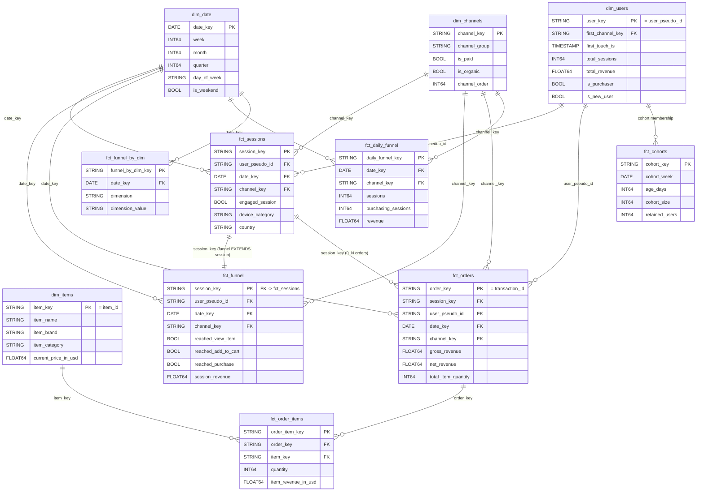

## 1. Overview & Layered Model

Helios transforms raw GA4 e-commerce telemetry into a governed, Kimball-style star schema that an autonomous multi-agent system can query *without ever authoring SQL by hand*. The data model is the foundation under everything else: the semantic layer (`semantic_layer.yaml`, 47 metrics) resolves every metric against a small set of mart grains, and the agents compose those governed metrics rather than touching the warehouse directly. This document is the canonical, production-grade specification of every table in that pipeline — its grain, primary key, foreign keys, owner/steward, and, most importantly, *why it exists*.

### 1.1 The layered DAG

Transformations flow through five layers, each with a single, non-overlapping responsibility. Building one logical step per layer is what keeps the warehouse cheap to query, the lineage legible, and downstream models insulated from upstream change.

```text
   bigquery-public-data.ga4_obfuscated_sample_ecommerce.events_YYYYMMDD
                       (date-sharded; one row per EVENT; nested params/items/ecommerce)
                                          |
   ┌──────────────────────────────────────────────────────────────────────────────┐
   │ RAW SOURCE   src_ga4.events                                                     │
   │   read only via source(); never queried directly downstream                    │
   └──────────────────────────────────────────────────────────────────────────────┘
                                          |
   ┌──────────────────────────────────────────────────────────────────────────────┐
   │ STAGING (view)   stg_ga4__events  ·  stg_ga4__event_params                      │
   │   1:1 typed/renamed access; flatten the event_params ARRAY once                 │
   └──────────────────────────────────────────────────────────────────────────────┘
                                          |
   ┌──────────────────────────────────────────────────────────────────────────────┐
   │ INTERMEDIATE (ephemeral/view)   int_ga4__sessionized  ·  int_ga4__funnel_steps  │
   │   business logic: reconstruct the session GA4 never ships; monotonic reached_*  │
   └──────────────────────────────────────────────────────────────────────────────┘
                                          |
   ┌──────────────────────────────────────────────────────────────────────────────┐
   │ MARTS (table/incremental)   star schema: conformed dims + wide fact tables      │
   │   FACTS: fct_sessions, fct_funnel, fct_daily_funnel, fct_orders,                │
   │          fct_order_items, fct_funnel_by_dim, fct_cohorts                        │
   │   DIMS:  dim_users, dim_items, dim_channels, dim_date                           │
   └──────────────────────────────────────────────────────────────────────────────┘
                                          |
   ┌──────────────────────────────────────────────────────────────────────────────┐
   │ SEMANTIC (view-of-marts)   semantic_layer.yaml → semantic-mcp                   │
   │   47 governed metrics resolve against 5 base grains; agents compose, not write  │
   └──────────────────────────────────────────────────────────────────────────────┘
```

**Why each layer exists.**

- **Raw source (`src_ga4.events`)** is the immutable source of truth owned by Google's GA4 export. Its rows are *events* with deeply nested `event_params`, `items[]`, and `ecommerce` structures. We read it exclusively through `source()` so that exactly one model touches the export schema; nothing downstream depends on the raw layout.
- **Staging** is the 1:1 typed/renamed access layer. It surfaces the scalar columns analysts actually need (`session_key`, `ga_session_id`, `page_location`, session-scoped source/medium, `device.*`, `geo.*`, `transaction_id`, `purchase_revenue_in_usd`) and flattens the nested `event_params` array exactly once so no downstream model ever re-`UNNEST`s. Staging isolates the entire pipeline from raw schema drift; materialized as cheap, always-fresh views.
- **Intermediate** holds the business logic that the raw export omits. GA4 ships no session row, so `int_ga4__sessionized` reconstructs one by grouping events on `(user_pseudo_id, ga_session_id)` and `int_ga4__funnel_steps` computes the six monotonic `reached_*` funnel flags. These two are the *keystones*: get them wrong and every downstream number is silently wrong. They are ephemeral/view — never exposed to BI.
- **Marts** are the conformed star schema: wide, denormalized fact tables surrounded by conformed dimensions, materialized as tables (incremental on the large facts) so the autonomous run hits a fixed, predictable BigQuery byte budget.
- **Semantic** is a thin governed view over the marts. It is the *only* path to SQL — `semantic-mcp.build_query` maps a metric name plus dimensions to mart columns, so an agent that asks for `revenue` by `channel_group` never sees a `JOIN` or a `SUM`.

### 1.2 The two grains-of-record

Helios has exactly **two entities of record**, each anchored to its own fact grain:

1. **The session** — one analytical visit, keyed by `session_key = TO_HEX(MD5(CONCAT(user_pseudo_id, '-', CAST(ga_session_id AS STRING))))`. The session is split across two co-grained facts: `fct_sessions` carries engagement and the wide session descriptive dimensions, while `fct_funnel` carries the monotonic `reached_*` flags plus deduped `session_revenue`. `fct_funnel` is the **primary** session grain the semantic layer queries — funnel, conversion, and revenue-per-session metrics all resolve there. The two join 1:1 on `session_key`; the funnel *extends* the session.
2. **The transaction** — one completed order, keyed by `order_key = transaction_id`. `fct_orders` is the deduped order header (gross/net revenue, refund, shipping, tax, quantity) and the entity of record for all order-grain financials. Its line items explode into `fct_order_items`.

A third, derived analytical entity — the **user** (`user_pseudo_id`) — is conformed in `dim_users` but is deliberately *cookie-grain*: `user_id` is almost always NULL in this dataset, so there is no cross-device stitching. One human on a phone and a laptop is two users. This is carried as an honesty caveat on every user-grain metric (ARPU, new/returning users) — they are per-cookie approximations, never true person counts.

### 1.3 Conformed dimensions

Four dimensions conform across the facts so the Decompose agent can pivot any metric across any slice without re-deriving the slice:

- **`dim_date`** — the date spine (2020-11-01..2021-01-31) with week/month/quarter/day-of-week/is_weekend for time-grain rollups.
- **`dim_users`** — the user entity-of-record (cookie-grain) with first-touch attribution and lifetime rollups.
- **`dim_channels`** — the 10 GA4 default channel groups produced by the single `channel_group_case()` macro, plus `is_paid`/`is_organic`/`channel_order`.
- **`dim_items`** — the product catalog (item name, brand, category 1..5, current price).

Because these dimensions are *conformed* (one shared definition, joined by surrogate key), a finding sliced by `device_category` in the funnel and a finding sliced by `device_category` in revenue use the same dimension values — the precondition for honest mix-vs-rate decomposition.

### 1.4 Mart → semantic grain mapping

The semantic layer resolves every one of its 47 metrics against exactly **five base grains**. The mapping is explicit and 1:1:

| Semantic grain | Backing mart | Entity | Metrics resolved here (examples) |
|---|---|---|---|
| `fct_funnel` | `fct_funnel` | session | `sessions`, `users`, `new_users`, `returning_users`, `session_conversion_rate`, `view_to_cart_rate`, `revenue`, `revenue_per_session`, `revenue_per_user` |
| `fct_sessions` | `fct_sessions` | session | `engaged_sessions`, `engagement_rate` |
| `fct_orders` | `fct_orders` | order | `orders`, `gross_revenue`, `net_revenue`, `aov`, `items_per_transaction` |
| `fct_order_items` | `fct_order_items` | order_item | product-level revenue, attach rate, units |
| `fct_cohorts` | `fct_cohorts` | cohort | `day_1_retention`, `day_7_retention`, `day_30_retention` |

The remaining marts — `dim_*`, `fct_daily_funnel`, `fct_funnel_by_dim` — are conformed dimensions or pre-aggregated rollups the agents read *indirectly*. `fct_daily_funnel` and `fct_funnel_by_dim` are additive aggregations of `fct_funnel` that feed the Monitor (anomaly detection), Decompose (mix-shift), and the eval injector; they store additive counts only, and all *rates* are computed in the semantic layer from those counts so they re-aggregate correctly across any slice.

### 1.5 The Kimball / wide-fact philosophy

Helios follows dimensional modelling deliberately. Each fact table declares exactly one grain; conformed dimensions are shared by surrogate key; and the facts are **wide** — descriptive dimensions (`device_category`, `country`, `channel_group`, `is_new_user`, `landing_page`) are denormalized directly onto `fct_funnel`/`fct_sessions`/`fct_orders`. The semantic layer therefore slices a metric by simply `GROUP BY`-ing a column on the same fact, with no join at query time. That is what lets a Sonnet-class agent request "`revenue` by `channel_group` and `device_category` for last week" and get governed, reconciled SQL the agent never wrote: the breadth lives in the mart, not in ad-hoc query construction. Wide facts trade a little storage and ETL discipline for *zero* analyst-authored joins, which is precisely the property the grounding principle ("the LLM never authors raw SQL") requires.

---

## 2. Entity Relationship Diagram

### 2.1 Mermaid ER diagram



> Aggregation (NOT a foreign key): `fct_funnel` is rolled up — `COUNT`/`SUM` of additive measures — into `fct_daily_funnel` (by day × channel × device × country × is_new_user) and into `fct_funnel_by_dim` (by day × canonical dimension). These rollups carry no row-level FK back to `fct_funnel`; they are pre-aggregated derivatives.

### 2.2 ASCII star schema

```text
                                   ┌───────────────┐
                                   │   dim_date    │
                                   │ PK: date_key  │
                                   └───────┬───────┘
                                           │ date_key (1 ── *)
                                           │
   ┌───────────────┐                ┌──────┴───────────────────┐               ┌───────────────┐
   │  dim_users    │  user_pseudo_id│        FACT CORE          │ channel_key   │ dim_channels  │
   │ PK: user_key  ├────────────────┤                          ├───────────────┤ PK:channel_key│
   └───────┬───────┘   (1 ── *)     │  fct_sessions  1───1      │   (1 ── *)    └───────────────┘
           │                        │       │      fct_funnel   │
           │ cohort membership      │       │ session_key       │
           │ (1 ── *)               │       │ (0..N)            │
   ┌───────┴───────┐                │       v                   │
   │  fct_cohorts  │                │   fct_orders              │
   │ PK:cohort_key │                │   PK: order_key           │
   └───────────────┘                │       │ order_key (1 ─ *) │
                                     │       v                   │
                                     │   fct_order_items ────────┼──── dim_items
                                     │   PK: order_item_key      │ item_key (1 ── *)
                                     └──────────┬────────────────┘     PK: item_key
                                                │  aggregation (NOT FK)
                                                v
                                  fct_daily_funnel   fct_funnel_by_dim
                                  (day × dims rollup) (day × dimension rollup)
```

The facts sit in the center; the four conformed dimensions (`dim_date`, `dim_users`, `dim_channels`, `dim_items`) surround them. The two pre-aggregated rollups hang below the core as derived aggregations of `fct_funnel`, not as joined facts.

### 2.3 Relationship walk-through

- **`dim_date` 1 ── * facts (`date_key`).** Every event-grained and daily fact (`fct_sessions`, `fct_funnel`, `fct_orders`, `fct_daily_funnel`, `fct_funnel_by_dim`) carries one `date_key` pointing at exactly one calendar day; a day has many rows in each fact. This is the conformed time axis for all rollups.
- **`dim_users` 1 ── * {`fct_sessions`, `fct_orders`} (`user_pseudo_id`/`user_key`); `dim_users` 1 ── * `fct_cohorts`.** A user has many sessions and zero-or-more orders; cohort membership is a rollup of `dim_users` first-touch into weekly acquisition cohorts. Identity is cookie-grain, so a "user" here is a device+browser cookie, not a person.
- **`dim_channels` 1 ── * {`fct_sessions`, `fct_funnel`, `fct_orders`, `fct_daily_funnel`} (`channel_key`).** One of 10 channel groups attaches to many sessions/orders. Channel is session-scoped first-touch (the `traffic_source` gotcha): the durable user-level `traffic_source` is *first-touch* attribution, so the session-scoped `event_params` source/medium is preferred and the user struct is only a fallback.
- **`dim_items` 1 ── * `fct_order_items` (`item_key`).** One catalog product appears on many order lines; the items dimension never joins above the line-item grain.
- **`fct_sessions` 1 ── 1 `fct_funnel` (`session_key`).** The funnel *extends* the session: exactly one funnel row per session row, same `session_key`. `fct_funnel` is the primary semantic grain; `fct_sessions` adds engagement. Splitting them keeps each fact single-purpose while preserving a clean 1:1 join.
- **`fct_sessions` 1 ── 0..N `fct_orders` (`session_key`).** A session yields zero or more orders — almost always 0 (most sessions don't buy) or 1. This is the bridge that lets revenue-per-session join order revenue back to the session universe.
- **`fct_orders` 1 ── * `fct_order_items` (`order_key`).** One deduped order header explodes into one row per item line. Order-level totals live on the header; line-level revenue lives on the items.
- **Aggregation rollups (NOT FKs).** `fct_funnel` is aggregated into `fct_daily_funnel` (additive daily counts + revenue, the feed for Monitor/Decompose and the eval injector) and `fct_funnel_by_dim` (funnel counts by one canonical dimension, the mix-vs-rate decomposition input). These are `GROUP BY` derivatives, carrying their own surrogate PKs and a `date_key` FK, but no row-level foreign key back to `fct_funnel`.

---

## 3. Master Table Catalog

Every table in the Helios pipeline, from raw source through the growth marts. Use these exact names, PKs, FKs, grains, and owners everywhere; the ER diagram above and every per-model section that follows must agree with this catalog.

| Table | Layer | Grain | Primary Key | Foreign Keys | Owner / Steward | Why it exists |
|---|---|---|---|---|---|---|
| `src_ga4.events` | raw | one row per EVENT | none enforced (natural: `user_pseudo_id`, `event_timestamp`, `event_name`, `event_bundle_sequence_id`) | none | Google / GA4 export | Immutable source of truth; nested `event_params`/`items`/`ecommerce`. Read only via `source()`, never queried directly except through staging. |
| `stg_ga4__events` | staging (view) | EVENT | surrogate `event_id` or natural (`user_pseudo_id`, `event_timestamp`, `event_name`) | → `src_ga4.events` | analytics-eng / platform | 1:1 typed/renamed access layer; surfaces `session_key`, `ga_session_id`, `page_location`, session source/medium, `device.*`, `geo.*`, `transaction_id`, `purchase_revenue_in_usd`. Isolates downstream from raw schema drift. |
| `stg_ga4__event_params` | staging (view) | EVENT × PARAM KEY | (event natural key, `param_key`) | → `src_ga4.events` | analytics-eng / platform | Flattens the nested `event_params` ARRAY once so no downstream model re-`UNNEST`s. |
| `int_ga4__sessionized` | intermediate (ephemeral/view) | SESSION | `session_key` | built from staging | analytics-eng | KEYSTONE. Reconstructs the session row GA4 never ships (group events by `(user_pseudo_id, ga_session_id)`); derives `landing_page`, session-scoped source/medium (`traffic_source` first-touch fallback), `channel_group`, device/geo, `engaged_session`, `is_new_user`, `ga_session_number`. |
| `int_ga4__funnel_steps` | intermediate (ephemeral/view) | SESSION | `session_key` | → `int_ga4__sessionized` | analytics-eng | KEYSTONE. Computes the 6 max-downstream monotonic `reached_*` flags + deduped `session_revenue`. |
| `fct_sessions` | mart / core (table) | SESSION (1 row/session) | `session_key` | `user_pseudo_id` → `dim_users.user_key`; `date_key` → `dim_date`; `channel_key` → `dim_channels` | analytics-eng / Product Analytics | The conformed SESSION entity-of-record: engagement, wide session dims, funnel reach. |
| `fct_funnel` | mart / core (table) | SESSION (1 row/session) | `session_key` (also FK → `fct_sessions`) | → `dim_users`, `dim_date`, `dim_channels` | analytics-eng / Product Analytics | The PRIMARY session grain the semantic layer queries (`reached_*` + `session_revenue` + wide dims); funnel/conversion/RPS resolve here. |
| `fct_daily_funnel` | mart / growth (table) | DAY × [channel_group, device_category, country, is_new_user] | `daily_funnel_key` (md5 of grain) | `date_key` → `dim_date`; `channel_key` → `dim_channels` | analytics-eng / Growth Analytics | Additive pre-aggregated daily funnel counts + revenue; feed for Monitor (anomaly), Decompose (mix-shift), and the eval injector. Rates NOT stored (computed in the semantic layer). |
| `fct_orders` | mart / finance (table) | TRANSACTION (1 row/transaction_id) | `order_key` (= `transaction_id`) | `session_key` → `fct_sessions`; `user_pseudo_id` → `dim_users`; `date_key` → `dim_date`; `channel_key` → `dim_channels` | analytics-eng / Finance & Revenue Analytics | The deduped order header; TRANSACTION entity-of-record; gross/net revenue, refund/shipping/tax, total_item_quantity; revenue & AOV inputs. |
| `fct_order_items` | mart / finance (table) | TRANSACTION × ITEM LINE (1 row/order-item) | `order_item_key` (md5 of transaction_id + item_id + row) | `order_key` → `fct_orders`; `item_key` → `dim_items` | analytics-eng / Finance & Revenue Analytics | The exploded `items[]` array; product-level revenue, items_per_transaction, attach rate. |
| `fct_funnel_by_dim` | mart / growth (table) | DAY × DIMENSION | composite (`date_key`, `dimension`, `dimension_value`) | `date_key` → `dim_date` | analytics-eng / Growth Analytics | Funnel rollup by canonical dimension; the mix-vs-rate decomposition input. |
| `fct_cohorts` | mart / growth (table) | COHORT_WEEK × AGE_DAYS | composite (`cohort_week`, `age_days`[, dims]) | `cohort_week` derived from `dim_users` first-touch | analytics-eng / Growth Analytics | Weekly acquisition cohorts (`cohort_size`, `retained_users`); feeds `day_1/7/30_retention` (semantic grain `fct_cohorts`). Honesty: the ~3-month window right-censors `day_30` for late cohorts. |
| `dim_users` | mart / core (table) | USER (1 row/user_pseudo_id) | `user_key` (= `user_pseudo_id`) | `first_channel_key` → `dim_channels` | analytics-eng (conformed) | The USER entity-of-record (cookie-grain); first-touch attribution, total_sessions/total_revenue, is_purchaser, is_new_user. |
| `dim_items` | mart / core (table) | ITEM (1 row/item_id) | `item_key` (= `item_id`) | none | analytics-eng (conformed) | The conformed PRODUCT catalog dimension (item_name, item_brand, item_category..5, current price). |
| `dim_channels` | mart / core (table) | CHANNEL_GROUP (10 rows) | `channel_key` | none | analytics-eng (conformed) | Conformed channel dimension; the 10 GA4 default groups + is_paid/is_organic/channel_order. |
| `dim_date` | mart / core (table) | DAY (1 row/day) | `date_key` | none | analytics-eng (conformed) | Conformed date spine 2020-11-01..2021-01-31; week/month/quarter/day_of_week/is_weekend for time-grain rollups. |

### Grain discipline

Every table in the catalog declares **exactly one grain**, and that grain is its contract. The four irreducible grains are:

- **SESSION** — one analytical visit, `session_key`. Carried by `int_ga4__sessionized`, `int_ga4__funnel_steps`, `fct_sessions`, and `fct_funnel`. `fct_funnel` is the canonical session grain the semantic layer resolves `sessions`, `users`, conversion rates, and `revenue` against.
- **TRANSACTION** — one completed order, `order_key = transaction_id`. Carried by `fct_orders` and exploded one level down to TRANSACTION × ITEM LINE in `fct_order_items`.
- **ITEM LINE** — one product line within an order, `order_item_key`; the only grain at which product-level revenue and attach rate are valid.
- **COHORT × AGE** — one weekly acquisition cohort at a given `age_days`, `cohort_key`; the grain for retention curves.

Plus the conformed dimension grains (DAY, USER, CHANNEL_GROUP, ITEM) and the two pre-aggregated rollup grains (`fct_daily_funnel` at day × dims; `fct_funnel_by_dim` at day × one dimension).

**Why mixing grains is forbidden.** A metric is only additive and reconcilable at its declared grain. Summing `session_revenue` at order grain, or counting `orders` at session grain, double-counts or under-counts because the row multiplicity differs across facts. The semantic layer enforces this: each metric is bound to one grain (`revenue` → `fct_funnel`, `gross_revenue`/`aov` → `fct_orders`, retention → `fct_cohorts`), and cross-grain comparisons are only sanctioned at the *grand total* (e.g. session-grain `revenue` reconciles to order-grain `gross_revenue` to within 0.5% in aggregate, but can legitimately differ per segment because the joins differ). Declaring one grain per table — and never widening or mixing it — is what makes every governed metric re-aggregate correctly across any slice the Decompose agent requests, and is the precondition for the "0 hallucinated columns / 100% governed SQL" target.

### Ownership model

**`analytics-eng` owns the pipeline end-to-end** — it builds and maintains every model from staging through the marts, owns all four conformed dimensions, and is accountable for the source-to-mart contracts. On top of that engineering ownership, each business domain assigns a **steward** who owns the *semantics* of a fact family: what the numbers mean, which caveats apply, and sign-off on changes that alter business meaning.

| Steward | Stewards which tables | Domain accountability |
|---|---|---|
| Product Analytics | `fct_sessions`, `fct_funnel` | Session/funnel semantics: engagement definition, monotonic `reached_*` flags, conversion-rate definitions. |
| Finance & Revenue Analytics | `fct_orders`, `fct_order_items` | Revenue semantics: dedup-by-transaction, USD-only money, the gross/net/refund/shipping/tax split, AOV basis. |
| Growth Analytics | `fct_daily_funnel`, `fct_funnel_by_dim`, `fct_cohorts` | Aggregation and cohort semantics: additive-counts-only rule, mix-vs-rate decomposition inputs, retention denominators and the right-censoring caveat. |
| analytics-eng (conformed) | `dim_date`, `dim_users`, `dim_channels`, `dim_items` | Conformed dimension definitions: the 10 channel groups, the date spine, cookie-grain user identity, the product catalog. |

**What ownership means in practice.** (1) *Schema changes* — adding, renaming, or retyping a column requires the owning steward's review, because downstream the semantic layer and the eval labels bind to physical names; a rename is a breaking change. (2) *Tests* — the owner is responsible for the dbt tests on their tables: grain-integrity (`unique` on the PK), `not_null` on keys, accepted-range on measures, funnel monotonicity, and revenue reconciliation. Keystone transforms (`int_ga4__sessionized`, `int_ga4__funnel_steps`, revenue dedup) get golden-value tests because they fail silently. (3) *SLAs* — owners commit to freshness (daily; available ≤36h after `event_date` for the semantic-facing facts) and to the CI eval gate: no change to an owned model may drop top-1 diagnosis accuracy by more than the agreed threshold or introduce a hallucinated column. Conformed dimensions, owned solely by analytics-eng, carry the strictest change control because a change there ripples through every fact that joins them.
