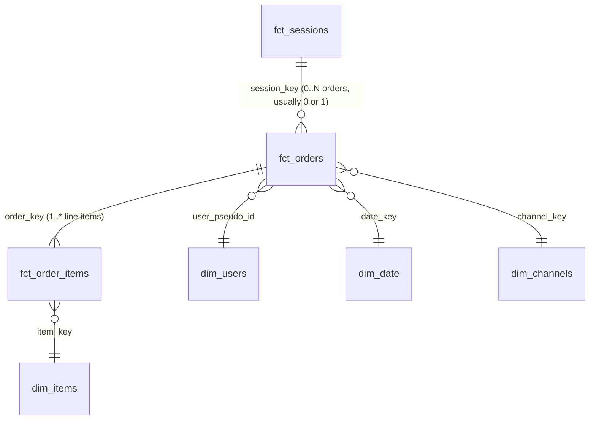

## 6. User Model

The user grain answers a different question than the session grain: not "what happened in this visit?" but "who is this person, where did they come from, and do they come back?" Helios resolves that grain with one conformed dimension (`dim_users`) and one acquisition-cohort fact (`fct_cohorts`). Both are built on a foundation that must be stated up front and carried into every user-level number: **identity in this dataset is cookie-grain, not person-grain.**

### 6.1 dim_users — the conformed USER entity-of-record

| property | value |
|---|---|
| Grain | one row per `user_pseudo_id` (USER = device/cookie) |
| Primary key | `user_key` (= `user_pseudo_id`) |
| Foreign keys | `first_channel_key` -> `dim_channels.channel_key` |
| Owner / steward | analytics-eng (conformed dimension) |
| Materialization | `table` |

**Why it exists.** GA4 ships events, not users. To answer "how many users did we acquire?", "what channel first brought them?", "is this a buyer?", and to provide a stable denominator for `revenue_per_user` (ARPU), Helios collapses the entire event stream to one row per `user_pseudo_id`. `dim_users` is the **single conformed user dimension** that `fct_sessions` and `fct_orders` join to (`user_pseudo_id` -> `user_key`) and that `fct_cohorts` rolls up from. Putting first-touch attribution and lifetime roll-ups here — rather than recomputing them per query — is what lets the semantic layer slice user metrics without re-scanning raw events.

| column | type | key | description |
|---|---|---|---|
| user_key | STRING | PK | `user_pseudo_id` (the cookie/device id) |
| first_touch_ts | TIMESTAMP | | `MIN(user_first_touch_timestamp)` — the user's first-ever event time |
| first_touch_source | STRING | | session-scoped source of the user's first session (first-touch) |
| first_touch_medium | STRING | | session-scoped medium of the first session |
| first_channel_key | STRING | FK -> dim_channels | `channel_group` surrogate of the first session (first-touch attribution) |
| total_sessions | INT64 | | `COUNT(DISTINCT session_key)` for the user |
| total_revenue | FLOAT64 | | `SUM(session_revenue)` (deduped) across the user's sessions |
| is_purchaser | BOOL | | TRUE if `total_revenue > 0` / the user has >= 1 transaction |
| is_new_user | BOOL | | TRUE if the user first appears in-window (first session has `ga_session_number = 1`) |

```sql
-- dim_users : one conformed row per user_pseudo_id, first-touch attribution + lifetime roll-ups
with first_session as (
  -- the user's earliest session decides first-touch source/medium/channel
  select user_pseudo_id,
         array_agg(struct(source, medium, channel_group)
                   order by session_start_micros limit 1)[safe_offset(0)] as ft
  from {{ ref('fct_sessions') }}
  group by user_pseudo_id
)
select
  s.user_pseudo_id                                   as user_key,
  timestamp_micros(min(s.first_touch_micros))        as first_touch_ts,
  any_value(fs.ft.source)                            as first_touch_source,
  any_value(fs.ft.medium)                            as first_touch_medium,
  any_value(c.channel_key)                           as first_channel_key,
  count(distinct s.session_key)                      as total_sessions,
  coalesce(sum(s.session_revenue), 0.0)              as total_revenue,
  coalesce(sum(s.session_revenue), 0.0) > 0          as is_purchaser,
  logical_or(s.ga_session_number = 1)                as is_new_user
from {{ ref('fct_sessions') }} s
join first_session fs using (user_pseudo_id)
left join {{ ref('dim_channels') }} c on c.channel_group = fs.ft.channel_group
group by 1
```

### 6.2 Cookie-grain identity — stated honestly

The user key is `user_pseudo_id`, the GA4 device/cookie identifier. The cross-device identifier `user_id` **is almost always NULL** in this obfuscated public dataset, so Helios performs **no identity stitching**. The consequences are not edge cases; they are structural, and the Critic agent attaches them to every user-grain finding:

- **A person on phone + laptop is two users.** Two cookies, two `user_pseudo_id`s, two rows in `dim_users`. There is no key that reunites them. `users`, `new_users`, and ARPU are therefore *device-cookie counts*, not headcounts, and are always over-stated relative to true humans.
- **Cookie churn inflates `new_users`.** Cleared cookies, Safari/ITP cookie expiry, incognito sessions, and re-consent all mint a fresh `user_pseudo_id`. A returning human on a new cookie looks simultaneously like a **churned user** (the old cookie went quiet) and a **brand-new acquisition** (the new cookie appears). New-vs-returning splits, and retention denominators, are biased by exactly this churn.
- **First-touch attribution lives on `dim_users`.** `first_touch_source / first_touch_medium / first_channel_key` capture the acquisition channel of the user's earliest session. This is deliberately a session-scoped attribution materialized once on the user row — *not* the raw `traffic_source` struct. (The `traffic_source` gotcha: event-level `traffic_source.*` is itself GA4's first-touch attribution, so reading it per session mislabels every later session with the acquisition channel. `dim_users` is the *correct* home for first-touch; `fct_sessions` carries session-scoped source instead.)
- **New vs returning is `ga_session_number = 1`.** A session is a new-user session when its `ga_session_number` (the per-cookie session ordinal) equals 1 — equivalently, when the `first_visit` event fired in it. `is_new_user` on `dim_users` is `LOGICAL_OR(ga_session_number = 1)` across the user's sessions; on `fct_sessions`/`fct_funnel` the same flag is per-session. Because the ordinal is per-*cookie*, churned-cookie returners are mis-classed as new — the same bias as above, surfaced through a different column.

> Honesty contract: any metric divided by `users` (ARPU, `new_users`, `returning_users`, all `day_N_retention`) is a **cookie-grain approximation** and must be narrated as such. Helios never claims person-level precision it does not have.

### 6.3 fct_cohorts — weekly acquisition cohorts feeding retention

| property | value |
|---|---|
| Grain | one row per (`cohort_week`, `age_days`) [optionally x dims] |
| Primary key | composite (`cohort_week`, `age_days`[, dims]) |
| Foreign keys | `cohort_week` derived from `dim_users.first_touch_ts` (cohort-membership rollup of `dim_users`) |
| Owner / steward | analytics-eng / Growth Analytics |
| Materialization | `table` |

**Why it exists.** Retention is a *cohort* question — "of the users we acquired in week W, how many came back by lifecycle-day N?" — and that cannot be answered from `dim_users` (no time-since-acquisition axis) or `fct_sessions` (no fixed acquisition denominator). `fct_cohorts` is the purpose-built fact whose grain *is* (acquisition week x lifecycle age), pre-computing `cohort_size` and `retained_users_d1/d7/d30` so the semantic layer's `day_1_retention`, `day_7_retention`, and `day_30_retention` resolve as simple `SUM(retained_users_dN) / SUM(cohort_size)` aggregations. It is the grain named by those three metrics (`grain: fct_cohorts`) and the input to `stats-mcp.cohort_retention`.

| column | type | key | description |
|---|---|---|---|
| cohort_week | DATE | PK | ISO-week (Monday) of `dim_users.first_touch_ts` — the acquisition cohort |
| age_days | INT64 | PK | lifecycle day relative to first touch (0, 1, 7, 30 are the reported anchors) |
| cohort_size | INT64 | | distinct users first-touched in `cohort_week` — the **FIXED** denominator |
| retained_users_d1 | INT64 | | users in the cohort with any session by lifecycle-day 1 |
| retained_users_d7 | INT64 | | users in the cohort with any session by lifecycle-day 7 |
| retained_users_d30 | INT64 | | users in the cohort with any session by lifecycle-day 30 |

How users roll in: every user lands in exactly one cohort, keyed by the ISO week (Monday) of `first_touch_ts` on `dim_users`. `cohort_size` is that week's distinct-user count and is **constant across all age rows of the cohort** (an invariant the semantic layer asserts). A user contributes to `retained_users_dN` if they have any session by lifecycle-day N — cumulative return *by* day N, not "active exactly on day N." Because the denominator is the fixed original cohort (never the surviving population), retention is monotonically non-increasing by construction: `day_1_retention >= day_7_retention >= day_30_retention`.

```sql
-- fct_cohorts : cohort_week x age_days, fixed-denominator retention
with users as (
  select user_key, date_trunc(date(first_touch_ts), week(monday)) as cohort_week,
         date(first_touch_ts) as ft_date
  from {{ ref('dim_users') }}
),
returns as (   -- earliest session date per user, to test "returned by day N"
  select user_pseudo_id as user_key,
         min(date(timestamp_micros(session_start_micros))) over (partition by user_pseudo_id) as ignore_me,
         date(timestamp_micros(session_start_micros)) as sess_date
  from {{ ref('fct_sessions') }}
)
select
  u.cohort_week, ages.age_days,
  count(distinct u.user_key)                                                          as cohort_size,
  count(distinct if(date_diff(r.sess_date, u.ft_date, day) between 1 and 1,  u.user_key, null)) as retained_users_d1,
  count(distinct if(date_diff(r.sess_date, u.ft_date, day) between 1 and 7,  u.user_key, null)) as retained_users_d7,
  count(distinct if(date_diff(r.sess_date, u.ft_date, day) between 1 and 30, u.user_key, null)) as retained_users_d30
from users u
join returns r using (user_key)
cross join unnest([1,7,30]) as age_days with offset
group by u.cohort_week, ages.age_days
```

**The ~3-month right-censoring caveat (carried, not hidden).** The dataset spans only 2020-11-01..2021-01-31. `day_30_retention` is **observable only for cohorts acquired >= 30 days before the window's right edge**; cohorts acquired in the final weeks have not yet *had* 30 lifecycle days to return, so their d30 numerators are mechanically incomplete (right-censored), not low. Including immature cohorts in a `SUM(retained_d30)/SUM(cohort_size)` over the whole window depresses the published rate artificially. Rules Helios enforces: `day_1_retention` is the least-censored (every cohort has a full 1-day horizon) and therefore the most trustworthy; `day_30_retention` must be restricted to *mature* cohorts; and small late cohorts are filtered by a minimum `cohort_size` threshold to keep tiny-cell noise out of the rate. The Critic flags any retention finding that mixes censored cohorts into a long-horizon rate.

---

## 7. Product Model

The product grain answers "which things did we sell, for how much, and how often do they appear in a basket?" Helios models it with the conformed `dim_items` catalog, an SCD2 snapshot (`snap_dim_items`) that gives that catalog history, and the `fct_order_items` line-item fact that explodes the purchase `items[]` array.

### 7.1 dim_items — the conformed PRODUCT catalog

| property | value |
|---|---|
| Grain | one row per `item_id` (ITEM = sellable product) |
| Primary key | `item_key` (= `item_id`) |
| Foreign keys | none (a leaf conformed dimension) |
| Owner / steward | analytics-eng (conformed dimension) |
| Materialization | `table` |

**Why it exists.** Item descriptors (`item_name`, `item_brand`, the `item_category` hierarchy) are repeated on *every* `items[]` element of *every* purchase/view event. Storing them once in a conformed catalog dimension — and joining `fct_order_items` to it on `item_key` — keeps the line-item fact narrow, gives every product a single canonical name/brand/category, and lets the semantic layer slice product metrics by `item_category` / `item_brand` without re-parsing arrays. It is the conformed product dimension shared across all product analysis.

| column | type | key | description |
|---|---|---|---|
| item_key | STRING | PK | `item_id` |
| item_name | STRING | | `items.item_name` (latest known) |
| item_brand | STRING | | `items.item_brand` |
| item_category | STRING | | primary category (`items.item_category`) |
| item_category2..5 | STRING | | the GA4 category hierarchy levels 2-5 |
| current_price_in_usd | FLOAT64 | | latest observed `items.price_in_usd` |

### 7.2 snap_dim_items — SCD2 history of price & category

`dim_items` holds the *current* state. But a product's price and category are **slowly-changing attributes**: a SKU can be re-priced, re-merchandised, or moved between categories within the analysis window. If a Diagnose finding says "AOV fell because Category X products dropped in price on Dec 12," the *current* price in `dim_items` cannot support that claim — the historical price is gone. `snap_dim_items` is the dbt **SCD2 snapshot** that preserves this history.

| property | value |
|---|---|
| Grain | one row per (`item_id`, validity interval) |
| Primary key | (`item_key`, `dbt_valid_from`) |
| Tracked columns | `price_in_usd`, `item_category` (+ hierarchy), `item_name` |
| Owner / steward | analytics-eng |
| Materialization | dbt `snapshot` (check strategy) |

```sql
-- snapshots/snap_dim_items.sql : SCD2 on price/category drift

{{ config(target_schema='helios_snapshots', unique_key='item_key',
          strategy='check',
          check_cols=['price_in_usd','item_category','item_category2','item_name']) }}
select item_id as item_key, item_name, item_brand,
       item_category, item_category2, price_in_usd
from {{ ref('stg_ga4__purchase_items') }}

-- dbt adds dbt_valid_from / dbt_valid_to / dbt_scd_id; a new row is cut whenever a tracked col changes.
```

**Why it exists.** It is the only place the model can answer time-travel product questions — point-in-time price, "what category was this SKU in on date D," whether an AOV/mix movement was a *price* change versus a *quantity/mix* change. `dim_items` (current state) is the default join for descriptive slicing; `snap_dim_items` (historical state) is consulted when a finding's correctness depends on the value *as of* a past date.

### 7.3 fct_order_items — the exploded line-item fact

| property | value |
|---|---|
| Grain | one row per (`transaction_id`, item line) |
| Primary key | `order_item_key` = `MD5(transaction_id + item_id + line row)` |
| Foreign keys | `order_key` -> `fct_orders.order_key`; `item_key` -> `dim_items.item_key` |
| Owner / steward | analytics-eng / Finance & Revenue Analytics |
| Materialization | `table` |

**Why it exists.** Order-level totals on `fct_orders` cannot tell you *which products* drove revenue or how baskets are composed. `fct_order_items` explodes the purchase `items[]` array into one row per line, giving the product-level grain that `product_revenue`, `items_per_transaction`, and `product_attach_rate` resolve against. It is the bridge between the transaction fact (`order_key`) and the product catalog (`item_key`).

| column | type | key | description |
|---|---|---|---|
| order_item_key | STRING | PK | `md5(transaction_id + item_id + row_number)` surrogate |
| order_key | STRING | FK -> fct_orders | the transaction this line belongs to |
| item_key | STRING | FK -> dim_items | the product on this line |
| item_name | STRING | | denormalized for convenience |
| item_category | STRING | | denormalized for convenience |
| quantity | INT64 | | units on this line (`items.quantity`) |
| item_revenue_in_usd | FLOAT64 | | line merchandise revenue (`items.item_revenue_in_usd`) |
| price_in_usd | FLOAT64 | | unit price (`items.price_in_usd`) |
| coupon | STRING | | line-level coupon if present |

### 7.4 How product metrics derive from the line grain

All product metrics are additive sums or order-distinct counts over `fct_order_items`:

- `product_revenue` = `SUM(item_revenue_in_usd)` (group by `item_key`/`item_category`). Merchandise value only — **excludes shipping/tax, is not refund-adjusted** — so it reconciles to `gross_revenue` at the grand total but is *not* identical line-by-line.
- `items_per_transaction` = `SUM(total_item_quantity) / COUNT(DISTINCT order_key)` (quantity per order).
- `product_attach_rate` = `COUNT(DISTINCT order_key with the item) / COUNT(DISTINCT order_key over ALL orders)` — basket penetration. **Order-distinct, not quantity-weighted** (three units count once), and the denominator is *all* orders, so attach rates sum past 100% across products. Mixing it onto a non-line grain double-counts multi-line orders — the reason it is pinned to `fct_order_items`.

### 7.5 The item-level view/purchase caveat

A product is commonly **viewed in one session and bought in a later one** (often on a different cookie/device — see §6.2). Therefore product-level *view* metrics and product-level *purchase* metrics live at different grains and must not be silently divided into a single-session "product conversion":

- The **purchase** side (`fct_order_items`) is anchored on `transaction_id` and the buying session/order. It is where `product_revenue`, units, and attach rate are exact.
- The **view** side comes from the `view_item` `items[]` array at the session grain, where the same product may appear across many sessions and users.

Because the view and the purchase need not share a session or even a cookie, Helios computes product *revenue/units/attach* from the item-line grain and treats any product-level *view-to-purchase* rate as a cross-session approximation that the Critic caveats — never a within-session conversion. This mirrors the cookie-grain honesty of §6: the demand signal is real, but the linkage between a specific view and a specific purchase is not guaranteed.

---

## 8. Order Model

### 8.1 fct_orders — the deduped order header

| property | value |
|---|---|
| Grain | one row per `transaction_id` (TRANSACTION) |
| Primary key | `order_key` (= `transaction_id`) |
| Foreign keys | `session_key` -> `fct_sessions`; `user_pseudo_id` -> `dim_users`; `date_key` -> `dim_date`; `channel_key` -> `dim_channels` |
| Owner / steward | analytics-eng / Finance & Revenue Analytics |
| Materialization | `table` |

**Why it exists.** GA4's `purchase` events are *not* clean order rows: the same `transaction_id` can appear on multiple event rows, and order-level totals are buried in the nested `ecommerce` struct. `fct_orders` is the **deduped order header — the TRANSACTION entity-of-record** — exactly one row per `transaction_id`, with merchandise/refund/shipping/tax totals lifted out of `ecommerce`. It is the grain the semantic layer's `transactions`, `gross_revenue`, `net_revenue`, and `aov` resolve against, and the conformed transaction node every finance metric joins from.

| column | type | key | description |
|---|---|---|---|
| order_key | STRING | PK | `transaction_id` |
| session_key | STRING | FK -> fct_sessions | originating session |
| user_pseudo_id | STRING | FK -> dim_users | buyer (cookie-grain) |
| date_key | DATE | FK -> dim_date | purchase date |
| channel_key | STRING | FK -> dim_channels | attributed channel |
| order_ts | TIMESTAMP | | purchase event timestamp |
| gross_revenue | FLOAT64 | | `ecommerce.purchase_revenue_in_usd` (merchandise; excludes shipping/tax) |
| refund_value_in_usd | FLOAT64 | | refund on the order (usually 0/NULL) |
| net_revenue | FLOAT64 | | `gross_revenue - COALESCE(refund_value_in_usd, 0)` |
| shipping_value_in_usd | FLOAT64 | | stored separately; never folded into revenue |
| tax_value_in_usd | FLOAT64 | | stored separately; never folded into revenue |
| total_item_quantity | INT64 | | units in the order |
| unique_items | INT64 | | distinct items in the order |

### 8.2 transaction_id dedup and NULL handling

GA4 exports emit **duplicate purchase rows** for one `transaction_id` (client retries, multi-stream collection, replays). A naive `SUM(purchase_revenue_in_usd)` double-counts. The fix: collapse to one row per `transaction_id` first (`ANY_VALUE` of each order-level field, which is identical across the dupes), *then* aggregate. **NULL `transaction_id`** rows are purchases GA4 failed to tag (test orders, mis-instrumented streams); they are excluded from `transactions` and `gross_revenue` but logged by the Critic as a data-quality caveat — a spike in NULL-id purchases can masquerade as a revenue drop.

```sql
-- fct_orders : one deduped row per transaction_id; net = gross - refund
with purch as (
  select
    ecommerce.transaction_id                          as order_key,
    {{ session_key('user_pseudo_id','ga_session_id') }} as session_key,
    user_pseudo_id,
    timestamp_micros(event_timestamp)                 as order_ts,
    any_value(ecommerce.purchase_revenue_in_usd)      as gross_revenue,   -- identical across dupe rows
    any_value(ecommerce.refund_value_in_usd)          as refund_value_in_usd,
    any_value(ecommerce.shipping_value_in_usd)        as shipping_value_in_usd,
    any_value(ecommerce.tax_value_in_usd)             as tax_value_in_usd,
    any_value(ecommerce.total_item_quantity)          as total_item_quantity,
    any_value(ecommerce.unique_items)                 as unique_items
  from {{ source('src_ga4','events') }}
  where event_name = 'purchase'
    and ecommerce.transaction_id is not null          -- drop untagged purchases
  group by order_key, session_key, user_pseudo_id, order_ts   -- collapse duplicate purchase rows
)
select
  order_key, session_key, user_pseudo_id, date(order_ts) as date_key, order_ts,
  gross_revenue,
  coalesce(refund_value_in_usd, 0.0)                 as refund_value_in_usd,
  gross_revenue - coalesce(refund_value_in_usd, 0.0) as net_revenue,
  coalesce(shipping_value_in_usd, 0.0)               as shipping_value_in_usd,
  coalesce(tax_value_in_usd, 0.0)                    as tax_value_in_usd,
  total_item_quantity, unique_items
from purch
```

### 8.3 gross vs net vs shipping/tax

- **gross_revenue** = deduped `SUM(purchase_revenue_in_usd)` — merchandise value, the headline `revenue`.
- **net_revenue** = `gross_revenue - refund_value_in_usd`. Refunds are near-zero in the sample window, so `gross_revenue ~= net_revenue`, but the distinction is preserved for the dollar-at-risk quantification every finding carries.
- **shipping/tax excluded.** `shipping_value_in_usd` and `tax_value_in_usd` are stored on `fct_orders` but **never folded into revenue or `aov`**, so AOV reflects merchandise value, not the total a customer paid. All money uses `_in_usd` columns only; the non-USD twins (`purchase_revenue`, `price`) are never aggregated.

### 8.4 revenue (session-attributed) vs gross_revenue (order grain) — reconciliation

Helios carries the same dollars at two grains, and they must reconcile at the grand total:

- **`revenue` / `session_revenue`** lives on **`fct_funnel`** (session grain): the deduped purchase revenue *attributed to the session in which it occurred*. This is what `revenue_per_session` and the funnel's revenue-at-risk use, because it sits beside the funnel flags.
- **`gross_revenue`** lives on **`fct_orders`** (transaction grain): the deduped order header total.

Both dedup by `transaction_id` and use `purchase_revenue_in_usd`, so `SUM(session_revenue)` over `fct_funnel` equals `SUM(gross_revenue)` over `fct_orders` at the grand total (within the 0.5% `reconcile` tolerance). They differ only in *grain and attribution axis* — session-scoped funnel analysis vs order-scoped finance analysis — never in the underlying dollars. A drift between them signals a dedup or join bug and fails the finding.

### 8.5 Relationships



- **`fct_sessions` 1 --- 0..N `fct_orders`** (via `session_key`): a session yields zero or more orders — usually 0 (most sessions never purchase) or 1, occasionally more. This is why session-to-order joins are LEFT joins and `session_revenue` defaults to `0.0`.
- **`fct_orders` 1 --- * `fct_order_items`** (via `order_key`): every order explodes into one or more line items, the bridge into `dim_items` and the basis for all product-level revenue.

Together these close the chain: `dim_users` / `dim_date` / `dim_channels` (conformed) -> `fct_sessions` -> `fct_orders` -> `fct_order_items` -> `dim_items`, with the same deduped dollars reconciling from the session funnel down to the product line.
